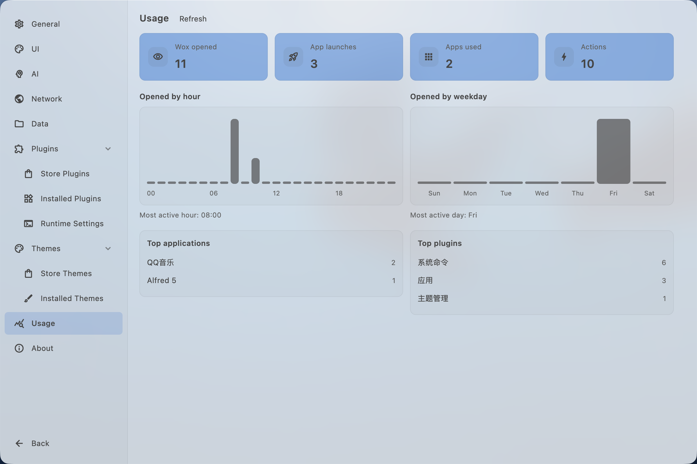

# Changelog

## v2.0.1 -

## v2.0.0 - 2026-02-09

It's time to release the official 2.0 version! There are no major issues in everyday use anymore. Thank you to all users who tested the beta version and provided feedback!

- Add
  - [`Calculator`] Add comma separator support in Calculator plugin #4325
  - [`File Explorer Search`] Add type-to-search feature (experimental, default is off, user can enable this in plugin setting). When enabled, user can type to filter in finder/explorer windows.
    
    

- Improve
  - [`File`] Improve everything sdk integration stability (with 1.5a support) #4317

- Fix
  - [`File Explorer Search`] Fix a issue that file explorer search plugin's settings do not load #4326
  - [`Clipboard`] Fix a issue that Clipboard plugin cannot paste to active window #4328
  - [`Wpm`] Fix a issue where WPM couldn't create script plugins #4330

## v2.0.0-beta.8 — 2026-01-10

- Add
  - [`Emoji`] Add ai search support for Emoji plugin (you need to enable AI feature in settings first)
    
  - Add auto theme which changes theme based on system light/dark mode
    
  - [`Explorer`] Add Explorer plugin to quick switch paths in Open/Save dialog #3259, see [Explorer plugin guide](https://wox-launcher.github.io/Wox/guide/plugins/system/explorer.html) for more details
  - Add loading animation to query box during plugin metadata fetching to improve user experience

- Improve
  - Improve markdown preview rendering performance and stability
  - Critical deletion actions have been implemented to recycle bin, this will prevent accidental data loss #3958
  - Improve docs website [https://wox-launcher.github.io/Wox/guide/introduction.html](https://wox-launcher.github.io/Wox/guide/introduction.html)
  - Support multiple-line text in query input box #3797
    
  - Improve database recovery mechanism to prevent database corruption on cloud disk sync (icloud, onedrive, dropbox, etc.)

- Fix
  - Fix clipboard history cause windows copy mal-function #4309
  - Fix switching to application alway opens a new window instead of focusing existing one #1922
  - Fixed the parsing issue of lnk files on Windows #4315
  - Fix the issue where plugin configuration is lost after plugin upgrade

## v2.0.0-beta.7 — 2025-12-19

- Add
  - Add MCP Server for Wox plugin development (default enabled on port 29867, can be configured in settings)
  - Add thousands separator for numbers in Calculator plugin `#4299`
  - Add windows setting searches
  - Add usage page in settings
    

- Improve
  - Improve fuzzy match based on fzf algorithm
  - Improve app searches on windows by

- Fix
  - Fix working directory issues, adding getWorkingDirectory function for command execution context, close `#4161`
  - Fix command line window display issue when executing Script Plugin
  - [`AI Chat`] Fix a render issue
  - [`Emoji`] Fix copy large image not working on windows
  - [`Clipboard`] Fix clipboard image paste issue on windows
  - Fix a theme regression released on beta.6 that causes crash on invalid theme colors `#4302`

---

## v2.0.0-beta.6 — 2025-12-05

- Add
  - Add Emoji plugin
  - Add Launch Mode and Start Page setting

- Improve
  - UI now uses safe color parsing (`safeFromCssColor`) to fall back gracefully when theme colors are invalid, preventing crashes and highlighting misconfigured themes.

---

## v2.0.0-beta.5 — 2025-09-24

- Fix
  - Fix a regression issue that some settings can't be changed on beta.4 @yougg

---

## v2.0.0-beta.4 — 2025-08-24

- Add
  - Quick Select to choose results via digits/letters
  - MRU for query mode, use can now display MRU results when opening Wox
  - Last Query Mode option (retain last query or always start fresh, #4234)
  - Custom Python and Node.js path configuration (#4220)
  - Edge bookmarks loading across platforms
  - Calculator plugin: add power operator (^) support

- Improve
  - Migrate settings from JSON to a unified, type-safe SQLite store
  - Reduce clipboard memory usage
  - Windows UX: app display details, Unicode handling, and UWP icon retrieval

- Fix
  - Key conflict when holding Ctrl and repeatedly pressing other keys
  - "Last display position" not restored after restart
  - Windows app extension checks (case-insensitive, #4251)
  - Image loading error handling in image view

---

## v2.0.0-beta.3 — 2025-06-23

- Add
  - Chat plugin: support multiple tool calls executed simultaneously in a single request
  - Chat plugin: support custom agents
  - ScriptPlugin support

- Fix
  - Windows sometimes cannot gain focus (#4198)

---

## v2.0.0-beta.2 — 2025-04-18

- Add
  - Chat plugin (supports MCP)
  - Double modifiers hotkey (e.g., double-click Ctrl)
  - [Windows] Everything (file plugin)

- Improve
  - Settings interface now follows the theme color
  - [Windows] Optimized transparent display effect

- Fix
  - [Windows] Focus not returning (#4144, #4166)

---

## v2.0.0-beta.1 — 2025-02-27

- Add
  - Cross-platform rewrite (macOS, Windows, Linux) with a single executable
  - Modern UI/UX with a new preview panel; AI-ready commands
  - Plugin system (JavaScript and Python); improved plugin store; better action filtering and result scoring
  - AI integrations (enhanced AI command processing; AI-powered theme creation)
  - Internationalization for settings
  - Enhanced deep linking
