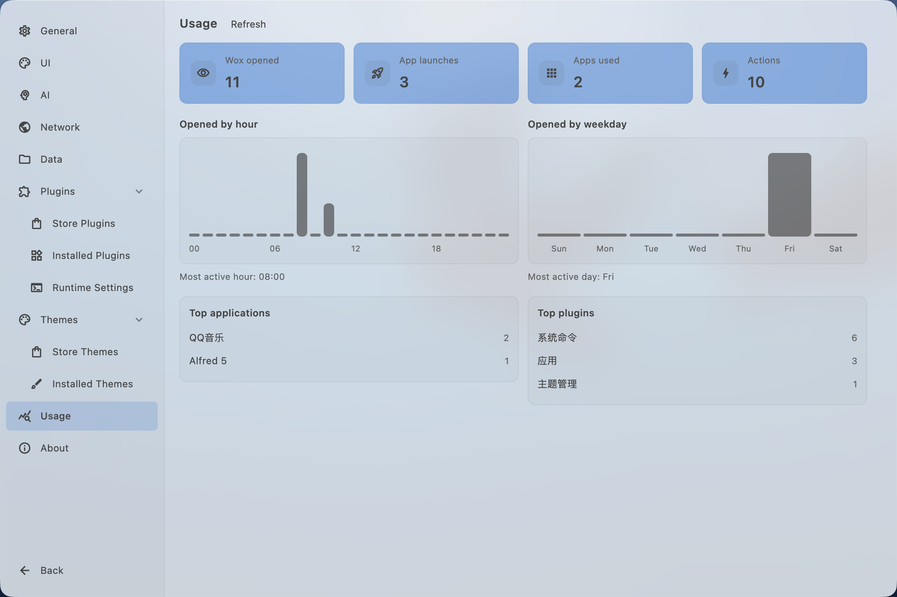

# Changelog

## v2.2.0 - 2026-06-18

This stable release rolls up the v2.1.2 beta work with additional Theme Editor, Linux Wayland, Caps Lock hotkey, update, and stability improvements.

- Add
  - [`Theme Editor`] Add a theme editor with live launcher preview, color controls, save-as and overwrite flows, platform-specific variants, and wallpaper-aware previews for customizing Wox themes #4421 #4415
  - [`Window Manager Plugin`] Add a Window Manager plugin to move, resize, minimize, maximize, restore, and send the active window between displays from launcher commands.
  - [`Selection`] Add Space Quick Look on Windows so users can preview a selected file from File Explorer or open/save dialogs by pressing Space.
  - [`Result Drag`] Add native file drag export for launcher results, allowing file-backed results from Clipboard and plugins to be dragged directly to folders or other apps.
  - [`Update`] Add release channels and channel switching so users can stay on stable releases or opt into beta prereleases.
  - [`Hotkey`] Add Caps Lock combo hotkeys and a Hotkey Overview preview so users can assign Caps Lock-based shortcuts and inspect registered Wox shortcuts. This feature is not available on Linux due to platform limitations.
  - [`Folder`] Add favorite folders with add, edit, delete, and direct global-search workflows.
  - [`System`] Add Task View and platform-specific volume control commands.

- Improve
  - [`Linux`] Improve native Wayland support with portal-backed global hotkeys, portal clipboard support, GTK backend selection, window positioning and resize handling, desktop-entry startup guidance, and Wayland-specific settings availability #4451
  - [`Preview`] Expand file preview support to code, executable, image, markdown, PDF, shortcuts, video, zip, Office, audio, font, calendar/contact, delimited data, RDP, folder, and media files, with tag-style preview metadata and a wider default preview panel.
  - [`Media Player`] Improve Windows media session integration so users can view the current track, see artwork, and control playback with play, pause, next, and previous actions from Wox.
  - [`Explorer`] Improve open/save dialog workflows with type-to-search hints, faster dialog path detection, quick folder jumps, and selection highlighting inside the active dialog.
  - [`Query Hotkey`] Improve query hotkey setup with a dedicated dialog, names, tooltips, presets documentation, variable editing, and cleaner hotkey availability checks.
  - [`Hotkey`] Improve hotkey recording, display, and Caps Lock handling across platforms, including better shortcut chip layout and stale modifier cleanup.
  - [`Search`] Improve fuzzy matching for short text and Pinyin input with better alignment and incomplete-syllable handling.
  - [`Clipboard`] Improve file clipboard records with support for multiple file paths, draggable file payloads, and favorites-aware query behavior.
  - [`Shell`] Improve shell commands with background execution, richer command history metadata, elapsed-time notifications, and safer Windows open behavior.
  - [`Update`] Improve manual update checks and update previews so release-channel actions refresh after checking.
  - [`Settings`] Improve settings search focus when opening settings.
  - [`WebView`] Improve embedded preview navigation with custom mouse button handling and more reliable URL and HTML session handling.
  - [`Logging`] Improve log file naming, rollover, retention, and bug report guidance so users can find and upload `wox.log` more easily #4438 #4446

- Fix
  - [`UI`] Fix Windows GPU recovery handling so Wox can restart the UI instead of leaving a blank window after GPU recovery #4437
  - [`Linux`] Fix tray icon menus not responding on Linux.
  - [`Shell`] Fix Windows open and reveal actions to use native Shell APIs, avoiding blocking launches and preventing crafted file paths from being interpreted as commands.
  - [`Hotkey`] Fix arrow-key hotkey recognition and stale Windows modifier state during hotkey recording.
  - [`Screenshot`] Fix permission-denied capture feedback with localized notifications #4433
  - [`Launcher`] Fix resize and focus edge cases during view transitions and Windows deactivation.

## v2.1.2-beta.2 - 2026-06-10

- Improve
  - [`Media Player`] Improve Windows media session integration so users can view the current track, see artwork, and control playback with play, pause, next, and previous actions from Wox.
  - [`Explorer`] Improve open/save dialog workflows with type-to-search hints, faster dialog path detection, quick folder jumps, and selection highlighting inside the active dialog.
  - [`Preview`] Improve preview metadata by using tag-style pills across AI Command, Clipboard, Selection, Shell, Update, Media Player, and Node.js plugin SDK previews.
  - [`PDF`] Improve PDF file preview by rendering PDFs through the shared WebView preview path.
  - [`System`] Improve system commands with a copy-version action for quickly sharing the current Wox version.
  - [`Update`] Improve manual update checks so the visible update preview and release-channel actions refresh after checking.
  - [`Logging`] Improve log file naming and bug report guidance so users can find and upload `wox.log` more easily #4446

- Fix
  - [`Shell`] Fix Windows open actions to use ShellExecute directly and avoid blocking when launching files, URLs, or folders.
  - [`Hotkey`] Fix hotkey recording so stale Windows modifier state does not leak into the next recorded shortcut.

## v2.1.2-beta.1 - 2026-06-05

- Add
  - [`Theme`] Add a theme editor with live launcher preview, color controls, save-as and overwrite flows, and wallpaper-aware previews for customizing Wox themes #4421
  - [`Window Manager`] Add a Window Manager plugin to move, resize, minimize, maximize, restore, and send the active window between displays from launcher commands.
  - [`Selection`] Add Space Quick Look on Windows so users can preview a selected file from File Explorer or open/save dialogs by pressing Space.
  - [`Attention`] Add persistent Attention items so plugins can surface follow-up tasks with an unread badge and an inbox that keeps items until users open or mark them read.
  - [`Result Drag`] Add native file drag export for launcher results, allowing file-backed results from Clipboard and plugins to be dragged directly to folders or other apps.
  - [`Update`] Add update channels so users can stay on stable releases or opt into beta prereleases.

- Improve
  - [`Preview`] Expand file preview support to code, executable, image, markdown, PDF, shortcuts, video, zip, Office, audio, font, calendar/contact, delimited data, and RDP files, with a wider default preview panel.
  - [`Query Hotkey`] Improve query hotkey setup with a dedicated dialog, names, tooltips, presets documentation, and cleaner variable editing.
  - [`Converter`] Improve storage and time conversion with decimal and binary byte aliases, unit-symbol tails, and broader timezone aliases.
  - [`Search`] Improve fuzzy matching for short text with optimal alignment scoring.
  - [`Query Box`] Improve text input and layout consistency across interface sizes #4423
  - [`Clipboard`] Improve file clipboard records with support for multiple file paths and draggable file payloads.
  - [`Image`] Improve emoji and URL image loading with caching and download support.
  - [`Update`] Improve update-available notification wording across languages.

- Fix
  - [`Screenshot`] Fix permission-denied capture feedback with localized notifications #4433
  - [`Hotkey`] Fix arrow-key hotkey recognition when alternate key names are reported by the platform.
  - [`Security`] Fix Windows file reveal behavior to use the Windows Shell API instead of interpolated PowerShell command text, preventing crafted file paths from being interpreted as commands when opening a file's containing folder.

## v2.1.1 - 2026-05-24

- Add
  - [`Settings`] Add settings search so users can find built-in and plugin settings by localized text without browsing each settings page.
    
  - [`AI Command`] Add an AI command template dialog and default-action selector, with built-in translation and summarization command templates for faster setup.
    
  - [`Bug Report`] Add built-in diagnostics collection and a toolbar indicator so users can prepare bug reports with relevant runtime context #4416

- Improve
  - [`AI`] Improve AI model selector loading with cached provider resources so settings forms can reuse model data more reliably.
  - [`Screenshot`] Improve capture on Windows with a native selection overlay, hover-aware region selection, deferred image loading, direction-aware scrolling stitching, and more reliable image cache cleanup.
  - [`WebView`] Improve embedded preview sessions with focus support, suspend and resume handling, and a toolbar action to hide Wox.
  - [`Overlay`] Improve overlay behavior with preserve-position, max-height, and follow-scroll options for workflows such as AI command result windows.
  - [`Runtime`] Improve Windows startup diagnostics by detecting missing Microsoft Visual C++ Redistributable dependencies and showing localized recovery guidance.
  - [`Runtime`] Improve Node.js and Python executable validation by enforcing supported minimum versions in runtime settings and host discovery, with clearer upgrade guidance for unsupported runtimes #4414
  - [`Hotkey`] Improve hotkey display with platform-aware modifier labels and more consistent rendering across grids, toolbar actions, refinement controls, and the recorder #4413
  - [`Query Hotkey`] Improve query hotkey editing with placeholder-variable insertion while preserving the caret position.
  - [`App`] Improve app search and icons with better global match selection, localized macOS app names, Windows Settings entries, and icon cache invalidation.
  - [`Theme`] Improve theme behavior with platform-specific overrides for Windows, macOS, and Linux.
  - [`Plugin`] Improve result polishing with layout-aware sizing so plugin results keep more consistent spacing in list and grid views.
  - [`Preview`] Improve preview content with metadata tags and selectable text support, making OCR, screenshot, clipboard, and rich previews easier to inspect and copy.
  - [`File Search`] Improve traversal performance, symlink handling, scan-rate status messages, and indexing diagnostics so skipped roots and scan progress are easier to understand when troubleshooting file search #4417
  - [`Clipboard`] Improve clipboard URL handling with a link refinement type and more robust URL parsing.
  - [`WPM`] Improve plugin store interactions with global query support.
  - [`Usage`] Improve usage statistics with daily breakdowns in the Usage settings page.
  - [`Navigation`] Improve keyboard navigation with Ctrl+N and Ctrl+P shortcuts in lists and launcher results. #4420
  - [`Memory`] Improve memory usage reporting with platform-specific retrieval on Windows and Linux.
  - [`Image`] Improve large icon and PNG handling with lazy raster loading, metadata-aware decoding, and transparent padding support for cleaner previews and lower memory pressure.

- Fix
  - [`Clipboard`] Fix clipboard type refinement hotkey behavior so filtered clipboard queries keep the expected hotkey logic.
  - [`OCR`] Fix OCR language handling on Windows and macOS so requested languages are normalized and recognized more reliably.
  - [`Settings`] Fix settings search and Escape-key handling so navigation and search state behave consistently.
  - [`Image`] Fix SVG loading error handling so broken vector images fail more gracefully.
  - [`Logging`] Fix crash diagnostics and Flutter logging behavior so startup and runtime errors are captured more consistently.
  - [`Launcher`] Fix Flutter frame timing issues and improve settings window responsiveness.
  - [`Updater`] Fix Linux executable replacement logic during updates.

## v2.1.0 - 2026-05-18

This version adds many new features and improvements. we hope you’ll like it, and wish you all a pleasant week!

- Add
  - [`Glance`] Add Glance to the query box so users can see lightweight real-time information, such as time, date, and battery status, cpu usage, and memory usage without typing a query. Plugins can provide glance metadata, and users can choose the glance item or hide the glance icon for a cleaner query box.
    
  - [`Screenshot`] Expand Screenshot with scrolling capture, pinned screenshot overlays, a plugin screenshot API, and configurable history retention. Users can capture long pages or windows, pin captures above other windows as visual references, let old screenshot files clean up automatically, and let plugins start direct capture workflows with hidden toolbar and auto-confirm options #4394
    
  - [`Preview`] Redesign the preview UI and add list previews and image overlay previews so result previews have a cleaner, more consistent surface, while image-heavy results, including clipboard and screenshot results, can open in a lightweight overlay instead of only inside the launcher preview panel.
    
    
  - [`Query Refinement`] Add refinement controls so plugins can expose filters and sort options directly in the launcher. File Search can filter files or folders and sort by relevance, name, modified time, or size; Clipboard and WPM can expose their own type and install-status filters.
    
  - [`AI Command`] Add default actions and Run And Paste support for silent query hotkey workflows. Users can select text in any app, press a hotkey, let an AI command optimize or translate the selected text, and replace the original selection in place when the final answer is ready. You can refer [https://wox-launcher.github.io/Wox/blog/did-you-know-ai-command-silent-translation-query-hotkey.html](https://wox-launcher.github.io/Wox/blog/did-you-know-ai-command-silent-translation-query-hotkey.html) for more details.
    
  - [`WebView`] Add actions to open preview pages in the system browser and clear saved WebView state, making embedded website previews easier to inspect, reset, and recover when a site keeps stale session data.
    
  - [`Usage`] Add X sharing for usage statistics so users can post their Wox usage summary directly from the usage page.
    
  - [`Onboarding`] Add the first-run flow with clearer setup steps for permissions, hotkeys, appearance, plugins, themes, tray queries, and Glance.
    
  - [`Glass dark theme`] Add new default Glass dark theme with acrylic blur, transparent panels, and light-colored text and icons for better visibility in dark mode. The new default theme also has improved color contrast and accessibility while still preserving the customizable accent color.
    
  - [`Color Plugin`] Add Color plugin to search and preview colors by name and hex code, with actions to copy color values in various formats.
    

- Improve
  - [`File Search`] Improve indexing performance, dynamic root management, hidden/system path handling, and incremental updates so large roots refresh faster and avoid duplicate or unsafe indexed paths.
  - [`Launcher`] Improve query run state, result caching, and concurrency handling so fast query changes keep the correct result session and preview state #4411
  - [`Query Box`] Improve multi-line query wrapping, pasted text handling, word-boundary deletion, and Linux Enter handling #4397 #4410
  - [`Settings`] Redesign the settings pages with clearer section structure, more consistent form controls, and cleaner spacing across General, Data, UI, Plugin, AI, Network, Privacy, Runtime, Usage, and About pages. Plugin-provided pixel styling is deprecated so settings can stay visually consistent while still preserving each setting's behavior and validation.
    
  - [`Plugin Store`] Improve install progress, plugin detail state, install-status filtering, and minimum Wox version checks so incompatible plugins are blocked earlier #4401
  - [`Linux`] Improve Wayland hotkeys, window movement, `.desktop` app indexing and launching, context menus, and file icon resolution #4400 #4404 #4405
  - [`App`] Improve macOS app icon handling, default icon detection, app directory tracking, and precise app index updates #4402
  - [`Converter`] Improve currency conversion with broader fiat currency support, exchange-rate refresh fallback, locale-aware default currencies, and clearer rate freshness display.
  - [`AI`] Improve OpenAI-compatible streaming so tagged reasoning content is separated from answer text.
  - [`Memory`] Reduce startup and core-process memory usage by lazy-loading Emoji data and releasing native macOS icon images after use.
  - [`File Explorer Search`] Improve type-to-search routing from launcher queries

- Fix
  - [`Plugin Store`] Fix plugin installation by starting the required runtime host when possible before install #4395
  - [`Plugin Setting`] Fix trigger keyword validation so multiple plugins can use the global `*` query
  - [`Launcher`] Fix Windows focus retry behavior that could select existing query text while the user was typing.
  - [`Shell`] Fix Windows command output encoding so Shell results preserve the expected text #4409

## v2.0.3 - 2026-04-26

- Add
  - [`Screenshot`] Add screenshot plugin with annotation, history, export path, clipboard handoff, keyboard confirmation, and multi-display handling. One more app to remove from startup list!  
       
    **Tips**: Use it with Query Hotkey to capture screenshots with a single shortcut
  - [`WebView`] Add configurable website previews with navigation actions, preview toolbar, cache controls, and Windows support.  
       
    **Tips**: Use it with Query Hotkey to open frequently used websites with one shortcut, such as Ctrl+Shift+I to quickly check Instagram and hide it again
  - [`Converter`] Add unit conversion support for length, weight, and temperature #4390
  - [`File Search`] Add native indexed file search with database-backed scanning, wildcard search, incremental changefeed sync, startup restore, and cross-platform providers. Everything plugin has been moved to [here](https://github.com/qianlifeng/Wox.Plugin.Everything)
  - [`Toolbar`] Add plugin toolbar messages API so long-running tasks can show progress and actions in the launcher
  - [`App`] Add customizable ignore rules for app indexing #4375
  - [`System`] Add shutdown and restart commands with confirmation prompts
  - [`Query Hotkey`] Add per-hotkey position, query box, toolbar, width, and result count options
  - [`Tray`] Add context menus and configurable result limits for tray queries

- Improve
  - [`Launcher`] Improve query result handling, height preservation, and resize timing to reduce flicker and input lag
  - [`Query`] Improve temporary query restoration, debounced plugin fallback, and result tracking for more stable query transitions
  - [`Plugin`] Improve uninstall progress reporting and host cleanup
  - [`File Icon`] Improve Windows file icon retrieval with associated file type fallback
  - [`Updater`] Improve macOS app replacement and Linux updater logging
  - [`Settings`] Improve loading of settings and AI model data

- Fix
  - [`Launcher`] Fix resize regressions, first-result painting flicker, and delayed window hiding on Windows
  - [`Tray`] Fix preview padding when tray query results only contain a preview
  - [`App`] Fix application indexing issues and query handling edge cases

## v2.0.2 - 2026-03-23

- Add
  - [`Plugin`] Add action to open a plugin's settings directly from query results
  - [`Clipboard`] Add action to open directory paths directly from clipboard results
  - [`AI`] Add MiniMax provider support
  - [`Privacy`] Add optional anonymous usage statistics with privacy controls
  - [`Hotkey`] Add ignored application list for global hotkeys #4372
  - [`Tray`] Add `Show Query Box` option for tray queries

- Improve
  - [`App`] Improve app search metadata and indexing on macOS and Windows, including System32 apps, Windows `.url` shortcuts, and cleaner Windows icons #4291 #4367
  - [`Plugin Setting`] Improve required-value validation in plugin tables and make AI model selection fall back to available provider configs #4365
  - [`AI`] Improve provider setup with default host configs and clearer provider icons
  - [`URL`] Improve URL results with dynamic website icons
  - Improve restoring the previously active window when Wox hides, with better tray interaction and Quick Select behavior on Windows
  - Improve locale detection when choosing the app language #4371
  - Improve switching to existing windows by matching window titles more reliably

- Fix
  - Fix opening URLs and file paths on Windows when the target contains `&` or quotes #4360
  - [`Clipboard`] Fix cross-platform clipboard handling for text, images, and file paths #4309
  - Fix Windows DWM refresh and acrylic resize jitter issues
  - Fix Linux release bundles so bundled shared libraries can resolve their packaged dependencies correctly #4347
  - [`Python Plugin`] Fix compatibility on modern macOS by requiring a newer Python runtime #4374

## v2.0.1 - 2026-03-07

- Add
  - Add tray query feature. User can add custom queries to tray menu for quick access
    
  - Add "App font family" setting to choose system font for Wox interface #4335
  - [`Plugin Setting`] Add image emoji selector for plugin table image fields
  - [`Plugin Setting`] Add `maxHeight` property support in plugin table setting value #4339
  - [`Plugin Store`] Add filter functionality and upgrade indicators for plugins #4356
  - [`Browser Bookmarks`] Add Firefox support #4354
  - [`Script Plugin`] Add missing runtime notifications with install actions #4357
  - Add secondary tap support for item actions in grid and list views #4358
  - [`Web Search`] Allow user to select custom browser #3597
  - [`Setting`] Add log management features including clearing logs and changing log level
  - [`File Explorer Search`] Add quick jump paths and enhance file dialog interactions

- Improve
  - [`Shell`] Enhance Shell plugin terminal preview to support search/full-screen/scroll-to-load functions
  - Improve query hotkey tooltips and add Wox Chrome extension link in settings #4333
  - Improve app process exit handling when shutting down Wox #4338
  - Improve the layout of the plugin settings page
  - [`Plugin Setting`] Improve focus management and validation
  - Improve preview functionality and local actions
  - Improve Windows Start Menu handling by dismissing it when Wox opens #4341
  - [`Calculator`] Improve history management and limit displayed history to top 100 entries #4340
  - Improve listview rendering performance

- Fix
  - [`File Explorer Search`] Fix an issue that file explorer search plugin cannot navigate on open/save dialog
  - [`Clipboard`] Fix self-triggering in clipboard watch #4309
  - Fix Windows hotkey recording so the Win key and modifier combinations can be captured correctly
  - Fix an issue that Wox setting table values can't be saved sometimes
  - Fix query results not being cleared correctly when app visibility changes
  - Fix transient focus loss when showing Wox window on Windows #4346
  - Fix Base64 JPEG decode issue in image preview
  - [`Plugin Setting`] Fix an issue with handling null and empty JSON responses in plugin table settings
  - [`File`] Fix Windows Phone Link automatic downloads occurring when fetching file icons #4352
  - [`Web Search`] Fix query URL formatting for escaped search text #4360
  - Fix image loading error handling in image view

## v2.0.0 - 2026-02-09

It's time to release the official 2.0 version! There are no major issues in everyday use anymore. Thank you to all users who tested the beta version and provided feedback!

- Add
  - [`Calculator`] Add comma separator support in Calculator plugin #4325
  - [`File Explorer Search`] Add type-to-search feature (experimental, default is off, user can enable this in plugin setting). When enabled, user can type to filter in finder/explorer windows.
    
    

- Improve
  - [`File`] Improve everything sdk integration stability (with 1.5a support) #4317

- Fix
  - [`File Explorer Search`] Fix a issue that file explorer search plugin's settings do not load #4326
  - [`Clipboard`] Fix a issue that Clipboard plugin cannot paste to active window #4328
  - [`Wpm`] Fix a issue where WPM couldn't create script plugins #4330

## v2.0.0-beta.8 — 2026-01-10

- Add
  - [`Emoji`] Add ai search support for Emoji plugin (you need to enable AI feature in settings first)
    
  - Add auto theme which changes theme based on system light/dark mode
    
  - [`Explorer`] Add Explorer plugin to quick switch paths in Open/Save dialog #3259, see [Explorer plugin guide](https://wox-launcher.github.io/Wox/guide/plugins/system/explorer.html) for more details
  - Add loading animation to query box during plugin metadata fetching to improve user experience

- Improve
  - Improve markdown preview rendering performance and stability
  - Critical deletion actions have been implemented to recycle bin, this will prevent accidental data loss #3958
  - Improve docs website [https://wox-launcher.github.io/Wox/guide/introduction.html](https://wox-launcher.github.io/Wox/guide/introduction.html)
  - Support multiple-line text in query input box #3797
    
  - Improve database recovery mechanism to prevent database corruption on cloud disk sync (icloud, onedrive, dropbox, etc.)

- Fix
  - Fix clipboard history cause windows copy mal-function #4309
  - Fix switching to application alway opens a new window instead of focusing existing one #1922
  - Fixed the parsing issue of lnk files on Windows #4315
  - Fix the issue where plugin configuration is lost after plugin upgrade

## v2.0.0-beta.7 — 2025-12-19

- Add
  - Add MCP Server for Wox plugin development (default enabled on port 29867, can be configured in settings)
  - Add thousands separator for numbers in Calculator plugin `#4299`
  - Add windows setting searches
  - Add usage page in settings
    

- Improve
  - Improve fuzzy match based on fzf algorithm
  - Improve app searches on windows by

- Fix
  - Fix working directory issues, adding getWorkingDirectory function for command execution context, close `#4161`
  - Fix command line window display issue when executing Script Plugin
  - [`AI Chat`] Fix a render issue
  - [`Emoji`] Fix copy large image not working on windows
  - [`Clipboard`] Fix clipboard image paste issue on windows
  - Fix a theme regression released on beta.6 that causes crash on invalid theme colors `#4302`

## v2.0.0-beta.6 — 2025-12-05

- Add
  - Add Emoji plugin
  - Add Launch Mode and Start Page setting

- Improve
  - UI now uses safe color parsing (`safeFromCssColor`) to fall back gracefully when theme colors are invalid, preventing crashes and highlighting misconfigured themes.

## v2.0.0-beta.5 — 2025-09-24

- Fix
  - Fix a regression issue that some settings can't be changed on beta.4 @yougg

## v2.0.0-beta.4 — 2025-08-24

- Add
  - Quick Select to choose results via digits/letters
  - MRU for query mode, use can now display MRU results when opening Wox
  - Last Query Mode option (retain last query or always start fresh, #4234)
  - Custom Python and Node.js path configuration (#4220)
  - Edge bookmarks loading across platforms
  - Calculator plugin: add power operator (^) support

- Improve
  - Migrate settings from JSON to a unified, type-safe SQLite store
  - Reduce clipboard memory usage
  - Windows UX: app display details, Unicode handling, and UWP icon retrieval

- Fix
  - Key conflict when holding Ctrl and repeatedly pressing other keys
  - "Last display position" not restored after restart
  - Windows app extension checks (case-insensitive, #4251)
  - Image loading error handling in image view

## v2.0.0-beta.3 — 2025-06-23

- Add
  - Chat plugin: support multiple tool calls executed simultaneously in a single request
  - Chat plugin: support custom agents
  - ScriptPlugin support

- Fix
  - Windows sometimes cannot gain focus (#4198)

## v2.0.0-beta.2 — 2025-04-18

- Add
  - Chat plugin (supports MCP)
  - Double modifiers hotkey (e.g., double-click Ctrl)
  - [Windows] Everything (file plugin)

- Improve
  - Settings interface now follows the theme color
  - [Windows] Optimized transparent display effect

- Fix
  - [Windows] Focus not returning (#4144, #4166)

## v2.0.0-beta.1 — 2025-02-27

- Add
  - Cross-platform rewrite (macOS, Windows, Linux) with a single executable
  - Modern UI/UX with a new preview panel; AI-ready commands
  - Plugin system (JavaScript and Python); improved plugin store; better action filtering and result scoring
  - AI integrations (enhanced AI command processing; AI-powered theme creation)
  - Internationalization for settings
  - Enhanced deep linking
