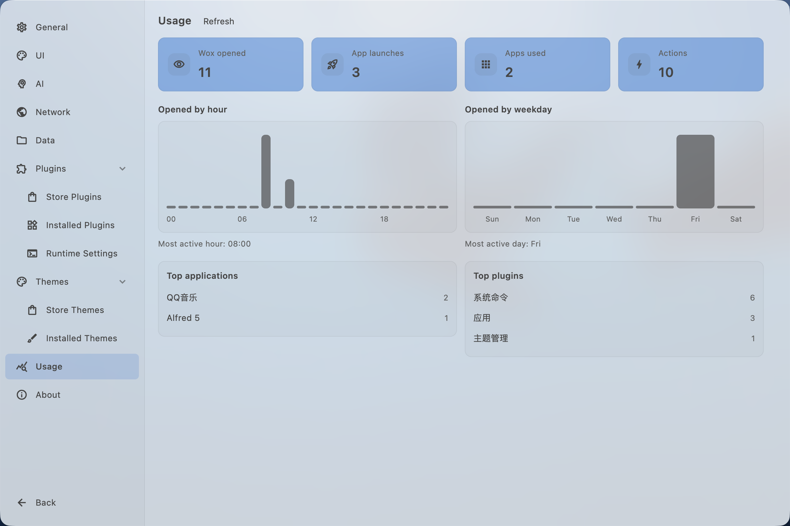

# Changelog

## v2.4.5 - 2026-09-23

此版本新增给任意结果设置全局快捷键或者搜索别名。

- Improve
  - [`Theme`] 新增 `.wox-theme`主题格式
  - [`Web Search`] 用 Ctrl/Cmd+Enter 在启动器里打开搜到的网页 [#4574](https://github.com/Wox-launcher/Wox/issues/4574)。
  - [`Launcher`] 可从工具栏或 Ctrl/Cmd+Shift+K 打开关于菜单。
    
  - [`AI Chat`] 在对话里用 @ 提及插件。
    
  - [`Shell`] 用 Ctrl/Cmd+T 在系统终端打开当前命令。
  - [`Hotkey`] 全屏时忽略启动器热键 [#4573](https://github.com/Wox-launcher/Wox/issues/4573)，COSMIC 支持全局快捷键 [#4576](https://github.com/Wox-launcher/Wox/issues/4576)。
  - [`Folder`] 可预览文件夹内容，并复制路径或名称。
  - [`Screenshot`] 可将截图发送到 AI 对话，便于你快速向AI询问/总结图片内容
  - [`Clipboard`] 用 `cb fav` 筛选收藏。
  - [`Settings`] 将热键设置独立出去。优化插件设置页面，将插件说明、设置和关键词显示在同一页。
  - [`App`] 可复制应用名称。隐藏后更省内存。
  - [`Preview`] HTML 预览跟随启动器颜色。
  - [`Confetti`] 用 `wox://confetti` 播放彩纸。

- Fix
  - [`Shell`] 修复命令输出无法选中复制 [#4581](https://github.com/Wox-launcher/Wox/issues/4581)。
  - [`App`] 修复 `.exe` 忽略规则隐藏快捷方式 [#4580](https://github.com/Wox-launcher/Wox/issues/4580)。
  - [`Launcher`] 修复拖入文件被最近列表替换，多屏缩放时位置错误 [#4572](https://github.com/Wox-launcher/Wox/issues/4572)。
  - [`Query`] 修复 `wox://` 链接打开空白启动器。
  - [`Clipboard`] 修复收藏不出现在开始页。
  - [`Settings`] 修复错误提示错位、下拉标签截断和插件路径空白。
  - [`Hotkey`] 修复按住组合键、Caps Lock 查询热键和录制误触。
  - [`Selection`] 修复按住快捷键时读不到选中内容。
  - [`Screenshot`] 修复截图里的中日韩文字变成方框。
  - [`Cloud Sync`] 修复付款链接打开错误页面。
  - [`Preview`] 修复无 `.svg` 后缀的图标不显示。
  - [`Attention`] 修复未读数缺少图标。
  - [`Linux`] 修复首次引导主题列表一直加载。

- Store
  - Plugin
    - [Stremio Search](https://github.com/NubPlayz/Stremio.Search.Wox.Plugin) Fast local library search & catalog lookup for Stremio [@NubPlayz](https://github.com/NubPlayz)
    - [JSON 格式化](https://gist.github.com/qianlifeng/0a8440a902dad5308dd3465e634a4428) 从查询、选中内容或文件格式化、压缩并校验 JSON [@qianlifeng](https://github.com/qianlifeng)
    - [随机数据生成](https://gist.github.com/qianlifeng/8299ba9cd0478ef75a22537b9ffd5353) 生成随机数字、UUID、密码、邮箱、姓名、颜色等。可指定数量，例如 random number 10 [@qianlifeng](https://github.com/qianlifeng)
    - [YouTube](https://gist.github.com/qianlifeng/04a9609de66eaa582a473f5852450ede) 搜索 YouTube 视频并在浏览器中打开 [@qianlifeng](https://github.com/qianlifeng)
  - Theme
    - [织](https://github.com/qianlifeng/Wox.Theme.Knit) 蓝灰与奶油白交织的毛衣边框，让工作空间温暖而清爽。 [@qianlifeng](https://github.com/qianlifeng)
      

## v2.4.4 - 2026-09-16

此版本带来新的 Jade 系统主题，并在 macOS 26 上使用 Liquid Glass。设置窗口使用独立外观，主题不再影响设置窗口。

- Improve
  - [`Theme`] 增加 Jade 主题，在 macOS 26+ 上使用 Liquid Glass，主题预览和实际启动器一致。主题还可以自定义窗口圆角、工具栏颜色和磨砂面板。
  - [`Settings`] 设置和首次引导使用独立外观，启动器主题不再影响这些窗口，插件目录筛选改为一次只选一个下拉条件
  - [`Query`] 命令可以提示补全并用 Tab 接受，可用 Ctrl/Cmd+Z 撤销查询改动，文件搜索、剪贴板和反馈不再显示多余的命令提示
  - [`Clipboard`] 可用 `cb paste` 一条一条粘贴历史记录，可为图片收藏和改名，复制的链接会显示网站图标，并可打开文件所在文件夹 [参见视频](https://raw.githubusercontent.com/Wox-launcher/Wox/refs/heads/master/screenshots/sequential_paste.mp4)
  - [`Converter`] 能理解更多日常计算说法，可解码粘贴的 Base64 或把文本编码为 Base64，支持 `now` / `now in` 问时间，并更可靠地处理播放速度、四舍五入、计圈时间
  
  - [`AI`] 支持将 SiliconFlow 作为聊天提供商
  - [`AI Chat`] 可把文件和图片粘贴或拖进对话 [#4566](https://github.com/Wox-launcher/Wox/issues/4566)，模型和技能列表打开更快，弹出的聊天窗口可用 Escape 关闭，流式回复更顺畅
  - [`File Search`] 文件名需要包含你输入的每个词才会匹配 [#4560](https://github.com/Wox-launcher/Wox/issues/4560)，并更可靠地搜索 PDF 里的文字 [#4564](https://github.com/Wox-launcher/Wox/issues/4564)
  - [`App`] 能找到 Windows 商店和「应用」文件夹里的应用，并更快发现新安装的应用 [#4565](https://github.com/Wox-launcher/Wox/issues/4565)
  - [`Web Search`] 支持在隐私/无痕窗口中打开搜索
  - [`Plugin`] 打开 `.wox` 文件即可安装插件，能找到 mise 安装的 Node.js 和 Python 且不必重启 Wox [#4569](https://github.com/Wox-launcher/Wox/issues/4569)，从结果里拖出文件后启动器保持打开，Attention 未读数重新显示，并可从通知打开对应插件设置
  - [`Notes`] 在预览和 Markdown 之间切换时不再跑掉光标，粘贴图片和文本更可靠，并显示字数
  - [`Launcher`] 可用 Ctrl（macOS 上为 Option）加上下方向键在结果分组间跳转，列表滚动时仍能看到底部工具栏，收藏用星标、置顶用图钉，操作列表会先显示最匹配的项
  - [`Hotkey`] Windows 上可以把 Win+Space 录成 Wox 热键
  - [`Browser Bookmark`] 可用 `b` 搜索书签，在该命令下标题和网址匹配更宽松
  - [`Folder`] 可从文件夹结果打开上一级文件夹
  - [`Selection`] 更可靠地读取当前选中的文本和文件，包括 Wox 自己的窗口 [#4561](https://github.com/Wox-launcher/Wox/issues/4561) [#4558](https://github.com/Wox-launcher/Wox/issues/4558)
  - [`Font`] 字体选择器能列出已安装的 Windows 字体 [#4554](https://github.com/Wox-launcher/Wox/issues/4554)
  - [`Updater`] 更新预览显示中文发布说明，更新成功后播放彩纸

- Fix
  - [`File Search`] 修复新加入的文件夹搜不到
  - [`IME`] 修复在微信输入法等中文输入法下，Windows 英文输入无效
  - [`UI`] 修复透明窗口上光标不闪烁，以及模糊面板挡住结果列表
  - [`Clipboard`] 修复粘贴目标显示很长的窗口标题，而不是应用名
  - [`AI`] 修复无法选中 AI 回答
  - [`Media Player`] 修复在 Windows 上打开媒体播放器要等很久
  - [`Attention`] 修复一打字未读角标就消失
  - [`Screenshot`] 修复录制快捷键被拆成多个按键，而不是一个组合

- Store
  - Plugin
    - [锁定键盘](https://gist.github.com/qianlifeng/a46c95ef4bd0e5f782e873260ed72491) 锁定键盘，方便擦拭按键且不会误触快捷键 [@qianlifeng](https://github.com/qianlifeng)
    - [Droppy](https://gist.github.com/qianlifeng/b27ea5c3cc3f78d2f526c9b481ad9c24) 随时打开的文件盒子：拖进去暂存，再到别处拖出去。 [@qianlifeng](https://github.com/qianlifeng)
  - Theme
    - [Omarchy](https://github.com/basecamp/omarchy) Omarchy 默认 Walker 菜单风格：炭灰卡片、米色描边、整行灰色选中，以及柔和青绿的激活图标。 [@qianlifeng](https://github.com/qianlifeng)
    - Ocean Glass 蓝灰内容面板、原生材质边框和暖黄色强调色。 [@qianlifeng](https://github.com/qianlifeng)
    - [Wox Saffron](https://github.com/Wox-launcher/Wox) 暖象牙色浅色主题，青绿文字，查询框底部有一条藏红花色下划线。 [@qianlifeng](https://github.com/qianlifeng)

## v2.4.3 - 2026-09-09

此版本增加查询提示，让网页搜索等命令可以用 Tab 收集多个具名输入，而不再只有一个自由文本框。

- Add
  - [`Query`] 为命令模板增加查询提示，用户可以用参数芯片、幽灵占位符和 Tab 补全填写多段命令。网页搜索模板可以收集多个具名输入，包括启动器获得焦点前已选中的文本和剪贴板文本。
  - [`Feedback`] 增加内置反馈插件，用于导出诊断信息、查看崩溃报告、在复现前清理日志，以及打开 GitHub issue 或功能请求。  
  

- Improve
  - [`AI`] 将提供商下拉框分为 API 和已安装 CLI，为本地 CLI 提供商品牌图标，并支持搜索列表
  - [`AI Chat`] 支持把对话弹出到独立窗口，启动器隐藏后仍保留未发送草稿；可附加选中文本、文件和图片且不混入指令；将 `{wox:...}` 占位符作为 token 编辑 [#4543](https://github.com/Wox-launcher/Wox/issues/4543)，并将输入框从一行扩展到最多五行自动换行
  - [`File Search`] 空查询时显示操作系统最近文件，使用 Windows Jump Lists、macOS Spotlight 最近使用日期和 Linux recently-used.xbel
  - [`Quick Jump`] 将文件资源管理器搜索重命名为 Quick Jump（`jump`），按操作系统保存路径，跳过已忽略应用，可在 Wox 自己的 Windows 选择器中导航，并注入 32 位窗口钩子，使 Foxmail、Office 等 32 位宿主可用 [#4511](https://github.com/Wox-launcher/Wox/issues/4511)
  - [`App`] 支持从搜索中隐藏，可用通配符或已选应用的忽略规则，并提供匹配预览 [#4537](https://github.com/Wox-launcher/Wox/issues/4537)，同时支持日语（ja_JP）
  - [`Clipboard`] 支持将剪贴板图片和 emoji 粘贴到当前窗口 [#4538](https://github.com/Wox-launcher/Wox/issues/4538)
  - [`Plugin`] 支持查询精炼和静态 HTML 预览、运行时注册触发关键词，以及在 WPM 中复制用于创建插件的 AI 提示
  - [`Launcher`] 支持从操作面板重置结果的使用排名，对系统操作分组，并校验查询需求表单的必填字段
  - [`Hotkey`] 改进 macOS 热键录制，在缺少辅助功能权限时提示授权，并在全局录制不可用时回退到本地录制 [#4548](https://github.com/Wox-launcher/Wox/issues/4548)
  - [`Preview`] 将大型文本、Office 和 PDF 预览推迟到先显示详情之后，避免快速选择时触发沉重读取
  - [`Browser`] 改进浏览器窗口识别，使标签页结果始终限定在当前浏览器 [#4542](https://github.com/Wox-launcher/Wox/issues/4542)
  - [`Converter`] 将单位、货币、日期和百分比查询扩展为类型化表达式，让嵌套换算、小费、工作日和时区句子可以在一条查询中组合，并提供格式化、原始和问答结果的复制操作
    
  - [`Query`] 支持从操作面板将当前查询保存为快捷方式，并在设置中为查询热键、快捷方式和托盘查询增加查询测试按钮
  - [`Folder`] 支持在文件夹路径中使用 Windows 环境变量，例如 `%LOCALAPPDATA%`
  - [`Notes`] 支持拖动末尾手柄重新排序清单任务

- Fix
  - [`App`] 修复图标直接放在 XDG 数据图标目录中的 Linux 应用显示默认图标的问题
  - [`Quick Jump`] 修复 Windows「移动项目」文件夹选择器，并缩短卡住的窗口钩子等待，避免拖慢对话框导航 [#4511](https://github.com/Wox-launcher/Wox/issues/4511)
  - [`UI`] 修复 Windows 内存压缩时销毁已隐藏 WebView 渲染器的问题，并裁剪覆盖层下的原生文件预览以匹配圆角
  - [`Launcher`] 修复长查询文本的光标位置
  - [`AI Chat`] 修复应用目录扫描刷新查询时对话大约每 30 秒重置的问题 [#4551](https://github.com/Wox-launcher/Wox/issues/4551)，并在隐藏/显示后保持全屏聊天

- Store
  - Plugin
    - [Linkding](https://github.com/Myraxion/Wox.Plugin.Linkding) 在 Linkding 中搜索、保存和管理书签 [@Myraxion](https://github.com/Myraxion)
    - [GitHub](https://github.com/Wox-launcher/Wox.Plugin.Github) 管理 GitHub 的 issues 和通知 [@Wox-launcher](https://github.com/Wox-launcher)
    - [Notion](https://github.com/lmgarret/wox-notion-plugin) 在启动器中搜索 Notion 页面和数据库、跳转到最近页面，并快速记录笔记 [@lmgarret](https://github.com/lmgarret)

## v2.4.2 - 2026-09-03

此版本通过可选的 NTFS 服务加速 Windows 文件搜索，让大容量磁盘无需完整遍历也能保持索引最新。

- Improve
  - [`File Search`] 支持在 Windows 上安装服务，通过 MFT 和 USN 为 NTFS 卷建立可选的快速索引；内容搜索目录可与文件名搜索根目录分开配置；全局查询中的文件结果会分组，并支持只显示内容匹配
  - [`Confetti`] 通过 Confetti 命令显示全屏彩纸动画，可尝试查询 `confetti`
    
  - [`AI Chat`] 支持在设置中用服务器表格配置 MCP 服务器，可导入完整 mcpServers JSON、使用 OAuth，以及按服务器查看工具 [#4529](https://github.com/Wox-launcher/Wox/issues/4529)
  - [`Wox Memory`] 增加内置内存诊断，可查看 Wox 进程组成，包括 Go 堆、原生和按进程分解，以及实时 Glance
  - [`Clipboard`] 支持按 OCR 文本搜索剪贴板图片 [#4525](https://github.com/Wox-launcher/Wox/issues/4525)，并改进 macOS 对远程文件 URL 的处理 [#4532](https://github.com/Wox-launcher/Wox/issues/4532)
  - [`Folder`] 支持对子名称模糊匹配，并在输入时补全父目录路径
  - [`Shell`] 在历史记录中为正在运行的命令显示运行指示
  - [`Launcher`] 改进操作面板搜索别名，使本地化操作仍可通过英文名称和额外词找到
  - [`Explorer`] 在输入搜索时优先匹配当前目录 [#4527](https://github.com/Wox-launcher/Wox/issues/4527)
  - [`Indicator`] 支持按描述和名称匹配插件
  - [`Settings`] 支持从插件设置帮助文本打开链接
  - [`Screenshot`] 将默认截图历史保留天数从 30 天降为 15 天
  - [`UI`] 支持在结果和预览中播放 GIF 动画，不再压成静态图
  - [`App`] 支持韩语（ko_KR），并在索引路径缺失时核对 Windows 应用目录
  - [`Plugin`] 展示插件初始化失败，增加商店插件健康检查，并允许用户在设置中刷新 Python 和 Node.js 运行时

- Fix
  - [`Notes`] 修复新笔记默认不被置顶的问题
  - [`Explorer`] 修复输入搜索对话框提示在焦点交接时过早关闭
  - [`Launcher`] 将启动器高度限制在显示器工作区内 [#4527](https://github.com/Wox-launcher/Wox/issues/4527)
  - [`Clipboard`] 修复 Wox 自己的剪贴板写入被记为新历史条目
  - [`Linux`] 通过超时剪贴板命令，修复 X11 剪贴板读取卡住
  - [`App`] 在 Wox 隐藏后释放 GPU 和数据库缓存，并改进诊断中的原生内存统计
  - [`UI`] 修复滚动视图中滚动条覆盖层可见性，以及结果列表缩短时的错误更新

- Store
  - Plugin
    - [need](https://github.com/zzedbot/wox-plugin-need) 存储并快速检索本地键值笔记 [@zzedbot](https://github.com/zzedbot)
    - [Nextcloud 密码](https://github.com/zzedbot/wox-plugin-nextcloud-password) 搜索、查看、复制和修改 Nextcloud Passwords 中保存的密码 [@zzedbot](https://github.com/zzedbot)
    - [Timestamp](https://gist.github.com/qianlifeng/31363d95905325e9969d93d999e94b07) 在 Unix 时间戳和日期时间字符串之间转换 [@qianlifeng](https://github.com/qianlifeng)
    - [Scoop](https://gist.github.com/qianlifeng/75ee2660ab0bd347623a752b0f2d4cd9) 用 Scoop 搜索和管理 Windows 应用 [@qianlifeng](https://github.com/qianlifeng)
    - [视频下载](https://gist.github.com/qianlifeng/c6b0e26b0db6efa9e9e9cd6a9252e08b) 用 yt-dlp 从 1000+ 网站下载视频和音频 [@qianlifeng](https://github.com/qianlifeng)
    - [Hacker News](https://gist.github.com/qianlifeng/5505503cf2ab741e2073e8bc120fba77) 浏览 Hacker News 首页、话题和讨论 [@qianlifeng](https://github.com/qianlifeng)
    - [Speedtest](https://gist.github.com/qianlifeng/dd2735f0aedb12b99c0aa0e226771a8f) 通过 HTTP 下载、上传和延迟测试网速 [@qianlifeng](https://github.com/qianlifeng)
    - [声音切换](https://gist.github.com/qianlifeng/bb270f4d9d36053d6750244445e5bfc9) 快速切换音频输入和输出设备 [@qianlifeng](https://github.com/qianlifeng)
    - [GIF 搜索](https://gist.github.com/qianlifeng/ab5524eecdf36a9484265cd94b22f359) 从 GIPHY 和 The Finer Gifs Club 搜索 GIF 动图 [@qianlifeng](https://github.com/qianlifeng)

## v2.4.1 - 2026-08-28

此版本增加内置浮动笔记，可在独立窗口中记录文本、表格和图片，从启动器搜索并置顶，还能把剪贴板、截图等插件中的选中内容保存为笔记。

- Add
  - [`Notes`] 增加内置浮动笔记，无需离开当前工作流即可快速记录：可从启动器创建和搜索笔记，在独立窗口中编辑富文本、表格和图片附件，置顶笔记（包括跨 macOS Spaces），恢复最近笔记，导出 Markdown、文本或 HTML，通过云同步同步笔记文本并将图片保留在本机，以及从剪贴板、资源管理器、文件搜索、截图、选中内容和 Shell 把文本、文件或图片保存到笔记。

- Improve
  - [`Launcher`] 支持用 Alt（Windows/Linux）或 Command（macOS）加 1–9 运行当前可见结果，在较长的插件消息旁保持工具栏快捷键可见，并在结果尾部显示提示 #4513
  - [`App`] 支持从启动器结果卸载 Windows 应用，包括 UWP 包
  - [`Glance`] 默认启用 Glance，使当前时间等信息显示在查询框旁
  - [`Onboarding`] 将首次设置移到独立窗口，启动器隐藏后仍可用；用户可在开始使用前设置查询热键、入门插件和主题，并更可靠地完成 macOS 权限流程
  - [`File Search`] 支持在忽略规则中使用绝对文件夹路径，并在设置中显示索引大小、条目数和上次索引耗时 #4518
  - [`Screenshot`] 改进编辑器：可输入像素宽高（点击尺寸芯片或按 S）、锁定比例和宽高对调；颜色检查器更易读，在 macOS 上可复制所选颜色；JPEG 导出保留原始像素
  - [`Shell`] 支持默认和按命令的工作目录（主目录、上次使用或自定义），并提供目录选择器
  - [`Linux`] 通过 `ext-background-effect-v1` 支持合成器背景模糊，提供 Hyprland 专用深色/浅色主题变体，可在启动器上方显示 overlay HUD，并支持 layer-shell 窗口拖动
    
  - [`Theme`] 统一 Windows acrylic、macOS vibrancy 和 Linux 模糊的窗口材质，并让 overlay 控件在原生背景上保持可读
  - [`Preview`] 改进预览标签滚动、图片缩放平移，以及更新预览 Markdown 中 issue 引用的自动链接
  - [`Hotkey`] 在设置和引导中展示主热键注册失败
  - [`Updater`] 清理过期的 Windows 更新备份文件
  - [`Plugin`] 为卡住的插件下载设置超时

- Fix
  - [`Timer`] 修复删除计时器后仍残留过期 overlay
  - [`Preview`] 修复延迟的图片、WebView 和文件预览显示占位文本而不是加载指示
  - [`Settings`] 修复新安装时「切换输入法」默认开启
  - [`Linux`] 修复隐藏启动器时的 GTK 崩溃

## v2.4.0 - 2026-08-23

此正式版用嵌入式原生 UI 替换 Flutter UI，日常内存大约减半，并增加离线听写、文件内容搜索、倒计时和隐私模式，同时汇总 v2.4.0 beta 中的稳定性和跨平台改进。

- Add
  - [`UI`] 用嵌入式原生 UI 替换 Flutter UI，在进程内管理窗口、焦点、控件和 GPU 渲染，去掉独立 Flutter 进程，日常内存大约减半到约 150 MB，并在 Windows、macOS 和 Linux 上保持启动器与设置流程一致。
  - [`Dictation`] 增加本地语音转文字听写，支持可下载离线模型、可配置麦克风和模型加载、单击/双击/长按热键、实时状态 overlay、音频闪避、可搜索历史（保留原始和 AI 润色转写，可回放音频），以及用 AI 润色、输入到当前窗口、显示 overlay 或打开 AI Chat 的自定义操作。
  - [`File Search`] 增加可选的文件内容索引和搜索，可按文件内文字查找支持的文本、PDF 和 Office 文件；可选择索引扩展名、跟踪索引进度、使用带引号短语，并受益于更快的并行索引和更可靠的索引核对；预览跟随主题，并有明确的大文件限制。
  - [`Timer`] 增加内置倒计时，支持暂停/继续、可选备注、无障碍桌面 overlay，以及重启后持久化。可从启动器输入 `timer 5m` 或 `timer 1h meeting` 开始计时。 #4495
  - [`Privacy`] 增加供共用电脑临时使用的隐私模式：启用后，Wox 退出时清除本地数据，同时保留语言和热键等非敏感设置。

- Improve
  - [`AI Chat`] 改进 AI Chat：可复用本地和远程技能、内置工具、行内模型和技能选择、可配置工具使用、可取消的流式输出、摘要对话历史，以及回退搜索操作。
  - [`OCR`] 在系统 OCR 之外支持可下载的离线 PaddleOCR 模型，截图和剪贴板可分别选择模型。
  - [`Screenshot`] 改进捕获、标注和录制：包含光标、编号标记、带阴影的置顶 overlay、按显示器缩放的编辑器控件、更清晰的滚动截图边框，以及更一致的跨平台录制控件。
  - [`Preview`] 改进原生文件和 WebView 预览：可拖动的标题栏控件、用户代理预设、URL 校验、圆角、鼠标按键导航、Markdown、可滚动元数据，以及更清晰的窗口控件。
  - [`Launcher`] 改进查询编辑：多行输入、剪贴板操作、上下文菜单、次要点击操作、输入时稳定的结果布局，以及慢查询的加载指示。
  - [`Query`] 增加限定查询，可将结果固定到指定插件并显示范围图标；自动把计算器、转换器等仅展示结果记入查询历史。
  - [`Hotkey`] 改进热键录制和注册：左右侧修饰键、多键长按、F 键，更可靠的单击/双击/长按和 Caps Lock 组合，更清晰的注册回退提示，以及更多录制器提示位置 #4496
  - [`Media Player`] 改进正在播放结果：封面、专用预览、实时进度、播放控件、打开完整媒体播放器视图的操作，以及 Linux MPRIS 支持。
  - [`Explorer`] 改进输入搜索：可索引当前文件夹以外的结果，更快地在 Windows 打开/保存对话框中导航和选择，macOS 上的 Cmd+G 提示，以及资源管理器/Finder 与打开/保存对话框之间的快速切换 #4511
  - [`Overlay`] 改进可移动 overlay：可拖动标题栏、跟随宿主窗口，以及更清晰的关闭按钮和焦点行为。
  - [`Onboarding`] 扩展首次引导：主热键、选中热键、平台托盘设置、交互演示，以及引导式 macOS 权限流程。
  - [`Window Manager`] 改进工作区恢复：分辨率变化后更可靠的显示器匹配，以及更快放置新启动的应用。
  - [`Cloud Sync`] 改进登录后的设置指引，并使每项同步进度更清晰。
  - [`Converter`] 改进时间和时长结果：本地化星期和单位、24 小时格式、更可靠的日期和时区计算，以及获取加密货币价格前确认 #4480
  - [`AI`] 支持 Ollama Cloud 及其默认端点，并改进与 OpenAI 兼容中继的兼容性 #4473
  - [`Indicator`] 允许插件结果直接打开对应插件设置。
  - [`Theme`] 改进 AI 生成主题的 JSON 提取和预览指引。
  - [`Settings`] 改进设置控件尺寸、悬停反馈、禁用表格状态、对话框操作，以及各设置页的表单布局一致性 #4503
  - [`Clipboard`] 允许用户从剪贴板历史中排除应用，并改进 Linux Wayland 和 X11 下的文本和图片剪贴板处理。
  - [`Shell`] 支持在 Windows 上以管理员身份通过 UAC 提升运行 Shell 命令。
  - [`App`] 支持从启动器结果以管理员身份运行 Windows 应用 #4498
  - [`Diagnostic`] 为错误报告捕获崩溃事件，Windows 崩溃产物更可靠。
  - [`Plugin`] 用看门狗恢复不健康的插件宿主进程，提高宿主可靠性。
  - [`Linux`] 改进 Hyprland 和 GTK 渲染、指针和滚动捕获、逐像素透明和指针穿透、窗口内提示、设置控件对齐，以及 `.deb` 和 `.rpm` 包分发。
  - [`Windows`] 改进 CJK 文本渲染、任务管理器应用分组、背景和深色外观同步，以及 DPI 切换稳定性。
  - [`macOS`] 改进隐藏窗口的内存释放，并使管理窗口在 Spaces 间保持可用。

- Fix
  - [`Calculator`] 通过在表达式中保留精确运算，修复浮点显示伪影 #4497
  - [`Input`] 修复打开启动器时 IME 模式被重置 #4493
  - [`Updater`] 修复下载的可执行文件与 Wox 安装不在同一驱动器时的 Windows 更新 #4471
  - [`Launcher`] 修复切换启动模式时预览面板尺寸和查询状态 #4474
  - [`Settings`] 修复 macOS 关闭设置窗口后内存累积、插件列表导航滚到错误位置，以及 Hyprland 上的设置渲染。
  - [`Linux`] 通过在 GTK 之前初始化 Xlib 线程支持修复启动崩溃，并修复 Hyprland 热键和剪贴板、X11 窗口可见性 #4505，以及无障碍更新期间的查询光标移动。
  - [`Windows`] 修复显示设备移除后的 GPU 渲染器恢复，并在 Wox 长时间隐藏后释放渲染器资源 #4502
  - [`Explorer`] 修复 Windows 上输入搜索的功能键处理和文件对话框窗口检测 #4504
  - [`Bookmark`] 修复 Chromium 书签加载 #4501
  - [`Cloud Sync`] 修复更新检查阻塞恢复流程。
  - [`Plugin`] 修复已禁用系统插件仍出现在结果中、没有显式图标的工具栏消息、插件宿主恢复，以及回收站删除可靠性。
  - [`Overlay`] 修复文本 overlay 尺寸。
  - [`Emoji`] 修复默认开启思考的模型下的 AI emoji 匹配。
  - [`URL`] 修复缺少 favicon 的 URL 历史条目。

## v2.4.0-beta.3 - 2026-08-16

此 beta 稳定了 beta.2 引入的原生 UI，修复 Flutter UI 替换后出现的设置渲染、控件交互、overlay、预览和显示器恢复问题。

- Improve
  - [`Settings`] 改进设置控件尺寸、悬停反馈、禁用表格状态、对话框操作，以及各设置页的表单布局一致性。 #4503
  - [`Preview`] 改进 AI Chat 预览，增加可拖动标题栏控件和更清晰的窗口控件。
  - [`Launcher`] 改进查询编辑，使查询文本变化时插件结果布局保持稳定。
  - [`Overlay`] 改进可移动 overlay：可拖动标题栏并跟随宿主窗口，移动窗口时 overlay 仍对齐。
  - [`Screenshot`] 改进截图编辑器 UI 缩放、滚动截图边框和屏幕录制控件。
  - [`Hotkey`] 改进主热键注册，在快捷键无法注册时给出更清晰的回退提示。
  - [`Onboarding`] 扩展首次引导，增加主热键、选中热键和平台托盘设置步骤。
  - [`Query`] 改进启动器查询路由，支持将结果固定到指定插件，并在查询界面显示范围图标。
  - [`Shell`] 支持在 Windows 上以管理员身份通过 UAC 提升运行 Shell 命令。
  - [`Linux`] 增加 `.deb` 和 `.rpm` 包构建，并更新安装文档。

- Fix
  - [`Settings`] 修复 Hyprland 上的设置页渲染。
  - [`Windows`] 修复显示设备移除后的 GPU 渲染器恢复 #4502
  - [`Linux`] 修复 Hyprland 热键注册和剪贴板处理。
  - [`Explorer`] 修复 Windows 上输入搜索的功能键处理和文件对话框窗口检测 #4504
  - [`Bookmark`] 修复 Chromium 书签加载 #4501
  - [`Plugin`] 修复插件宿主恢复和回收站删除可靠性。

## v2.4.0-beta.2 - 2026-08-11

此 beta 用嵌入式原生 UI 替换 Flutter UI，使启动器和设置在同一进程中运行，日常内存大约减半到约 150 MB，并增加倒计时和供临时会话使用的隐私模式。  

- Add
  - [`UI`] 用嵌入式原生 UI 替换 Flutter UI，在进程内管理窗口、焦点、控件和 GPU 渲染，去掉独立 Flutter 进程，日常内存大约减半到约 150 MB，并在 Windows、macOS 和 Linux 上保持启动器与设置流程一致。
  - [`Timer`] 增加内置倒计时，支持暂停/继续、可选备注、桌面 overlay，以及重启后持久化。可从启动器输入 `timer 5m` 或 `timer 1h meeting` 开始计时。 #4495
  - [`Privacy`] 增加供共用电脑临时使用的隐私模式：启用后，Wox 退出时清除本地数据，同时保留语言和热键等非敏感设置。

- Improve
  - [`OCR`] 在系统 OCR 之外支持可下载的离线 PaddleOCR 模型，截图和剪贴板可分别选择模型。
  - [`Screenshot`] 改进跨平台捕获和标注：包含光标、编号标记和带阴影的置顶 overlay。
  - [`Preview`] 改进原生文件预览和带标题栏控件的 WebView 预览，增加用户代理预设、URL 校验、圆角和鼠标按键导航，以及 Markdown 和可滚动元数据。
  - [`Dictation`] 改进历史预览的音频回放控件。
  - [`Launcher`] 改进查询编辑：多行输入、剪贴板操作、上下文菜单、次要点击操作，以及慢查询的加载指示。
  - [`Query`] 自动把计算器、转换器等仅展示结果记入查询历史。
  - [`Hotkey`] 注册热键时支持 F 键，并增加中左/中右录制器提示位置 #4496
  - [`App`] 支持从启动器结果以管理员身份运行 Windows 应用 #4498
  - [`Converter`] 获取加密货币价格前先确认网络请求 #4480
  - [`Diagnostic`] 为错误报告捕获崩溃事件，Windows 崩溃产物更可靠。
  - [`Plugin`] 用看门狗恢复不健康的插件宿主进程，提高宿主可靠性。
  - [`Linux`] 改进 Hyprland layer-shell 启动器渲染、指针和滚动捕获、窗口内提示，以及云同步/设置控件对齐。
  - [`Windows`] 改进 CJK 文本渲染、任务管理器应用分组、背景和深色外观同步，以及 DPI 切换稳定性。
  - [`macOS`] 改进隐藏窗口的内存释放，并使管理窗口在 Spaces 间保持可用。

- Fix
  - [`Calculator`] 通过在表达式中保留精确运算，修复浮点显示伪影 #4497
  - [`Input`] 修复打开启动器时 IME 模式被重置 #4493
  - [`Linux`] 通过在 GTK 之前初始化 Xlib 线程支持修复启动崩溃 #4481
  - [`Launcher`] 修复切换启动模式时预览面板尺寸和查询状态 #4474
  - [`Settings`] 修复 macOS 关闭设置窗口后内存累积
  - [`Cloud Sync`] 修复更新检查阻塞恢复流程
  - [`Plugin`] 修复已禁用系统插件仍出现在结果中

## v2.4.0-beta.1 - 2026-07-14

此 beta 引入本地离线听写，便于快速语音转文字，同时增加文件内容搜索，并增强 AI Chat。

- Add
  - [`Dictation`] 增加本地语音转文字听写，支持可下载离线模型、可配置麦克风和模型加载、单击/双击/长按热键、实时状态 overlay、音频闪避、可搜索历史（保留原始和 AI 润色转写），以及用 AI 润色、输入到当前窗口、显示 overlay 或打开 AI Chat 的自定义操作。  

    
  - [`File Search`] 增加可选的文件内容索引和搜索，可按文件内文字查找支持的文本、PDF 和 Office 文件；可选择索引扩展名、跟踪索引进度、使用带引号短语，并受益于更快的并行索引和更可靠的索引核对；预览跟随主题，并有明确的大文件限制。  

    

- Improve
  - [`AI Chat`] 改进 AI Chat：可复用本地和远程技能、内置工具、行内模型和技能选择、可配置工具使用、可取消的流式输出、摘要对话历史，以及回退搜索操作。
    
  - [`Hotkey`] 改进热键录制和注册：左右侧修饰键、多键长按，以及更可靠的单击/双击/长按和 Caps Lock 组合。
  - [`Media Player`] 改进正在播放结果：封面、专用预览、实时进度、播放控件，以及打开完整媒体播放器视图的操作，并通过 MPRIS 扩展 Linux 支持。
  - [`Explorer`] 改进输入搜索：可索引当前文件夹以外的结果，更快地在 Windows 打开/保存对话框中导航和选择，以及 macOS 上的 Cmd+G 搜索提示。
  - [`Window Manager`] 改进工作区恢复：分辨率变化后更可靠的显示器匹配，以及更快放置新启动的应用。
  - [`Cloud Sync`] 改进登录后的设置指引，并使每项同步进度更清晰。
  - [`Converter`] 改进时间和时长结果：本地化星期和单位、24 小时格式，以及更可靠的日期和时区计算。
  - [`AI`] 支持 Ollama Cloud 及其默认端点，并改进与 OpenAI 兼容中继的兼容性 #4473
  - [`Indicator`] 允许插件结果直接打开对应插件设置。
  - [`Theme`] 改进 AI 生成主题的 JSON 提取和预览指引。

- Fix
  - [`Updater`] 修复下载的可执行文件与 Wox 安装不在同一驱动器时的 Windows 更新 #4471
  - [`Plugin`] 修复没有显式图标的工具栏消息，回退到插件图标。
  - [`Overlay`] 修复文本 overlay 尺寸，并改进关闭按钮和焦点行为。
  - [`Settings`] 修复直接导航到插件时插件列表滚到错误位置。
  - [`Emoji`] 修复默认开启思考的模型下的 AI emoji 匹配。

## v2.3.0 - 2026-07-04

此正式版为 Wox 引入云同步，并增加工作区布局，同时汇总 v2.3.0 beta 中的 Linux、预览、文件搜索、热键、设置和稳定性改进。

- Add
  - [`Cloud Sync`] 为设置、已安装插件和主题增加加密云同步，包括恢复码设置、本地快照、同步历史、账户套餐和设备管理、设备加入与撤销、法律协议检查、自动同步、部分成功历史，以及更清晰的服务器错误反馈。
  - [`Window Manager`] 增加工作区布局，可跨显示器保存应用，通过启动器命令或查询热键恢复，启动缺失应用，把窗口放到已保存布局，并以去重标签页方式打开浏览器 URL。

- Improve
  - [`Linux`] 改进 Wayland 和 Hyprland 支持：wlroots layer-shell 检测、Hyprland 热键、KDE 图片剪贴板、桌面启动环境修复、可拖动窗口状态、截图显示器捕获、Caps Lock 组合热键的 uinput 诊断检查、本地化 Wayland 热键帮助，以及关闭窗口动画的 FAQ 指引 #4458
  - [`Hotkey`] 扩展 Linux 热键：双击 Ctrl、Caps Lock 组合键、Backspace 注入、更好的输入权限检查和更清晰的诊断。同时在各平台支持反引号和波浪号热键。
  - [`Preview`] 改进文件预览：按需加载、macOS Quick Look、PDF 和大文件处理，以及控制文件搜索是否显示预览的设置 #4463
  - [`File Search`] 改进索引性能、全新全量索引批量同步、直接条目插入和用户主目录路径规范化，使搜索更快更可靠。
  - [`Shell`] 改进选中文件夹工作流：可在选中位置运行 Shell 命令，并规范化用户主目录路径。
  - [`Window`] 改进 Windows 显示器检测、按 DPI 缩放的窗口定位、启动器焦点诊断，以及设置/引导过渡 #4436
  - [`App`] 改进 Windows 应用搜索的 UWP 元数据获取和图标处理。
  - [`MRU`] 改进查询排名：按命令和上下文计分，使重复操作和已保存布局更可预期地出现。
  - [`Settings`] 改进响应式设置布局、标签处理、运行时语言更新、平台相关设置同步行为，以及云同步配置说明，使调整大小、切换语言或同步后设置页仍清晰可读。
  - [`Doctor`] 改进诊断检查的严重级别处理，使更新和环境检查能区分警告和阻塞问题 #4459
  - [`Theme`] 改进 macOS 壁纸获取和缓存，便于壁纸感知的主题预览。

- Fix
  - [`Linux`] 通过动态加载而不是启动时要求库，修复没有 `gtk-layer-shell` 的系统无法启动。
  - [`Clipboard`] 修复 KDE Wayland 桌面会话的图片粘贴，并改进 Windows 剪贴板历史键兼容性 #4467
  - [`Hotkey`] 修复重复按下修饰键触发误报热键事件 #4465
  - [`Calculator`] 修复表达式排名，使计算器结果优先匹配预期表达式 #4469
  - [`Launcher`] 修复启动器生命周期过渡期间的焦点和操作处理。

## v2.3.0-beta.2 - 2026.07-01

此 beta 改进 Linux 和 Wayland 可靠性，并扩展文件预览、文件搜索控件和选中文件夹的 Shell 工作流。

- Improve
  - [`Linux`] 改进 Wayland 和 Hyprland 支持：wlroots layer-shell 检测、Hyprland 热键、KDE 图片剪贴板、桌面启动环境修复、可拖动窗口状态、截图显示器捕获，以及关闭窗口动画的 FAQ 指引 #4458
  - [`Hotkey`] 扩展 Linux 热键：双击 Ctrl、Caps Lock 组合键、Backspace 注入、更好的输入权限检查和更清晰的诊断。同时在各平台支持反引号和波浪号热键。
  - [`Preview`] 改进文件预览：按需加载、macOS Quick Look、PDF 和大文件处理，以及控制文件搜索是否显示预览的设置 #4463
  - [`File Search`] 改进索引性能、全新全量索引批量同步、直接条目插入和用户主目录路径规范化，使搜索更快更可靠。
  - [`Window`] 改进 Windows 显示器检测、按 DPI 缩放的窗口定位，以及启动器焦点诊断 #4436
  - [`Cloud Sync`] 改进账户令牌恢复和过期会话反馈，使同步操作更清楚地处理刷新失败。
  - [`Settings`] 改进响应式设置布局、标签处理和运行时语言更新，使调整大小或切换语言后设置页仍可读。
  - [`Doctor`] 改进诊断检查的严重级别处理，使更新和环境检查能区分警告和阻塞问题 #4459
  - [`Theme`] 改进 macOS 壁纸获取和缓存，便于壁纸感知的主题预览。

- Fix
  - [`Clipboard`] 修复 KDE Wayland 桌面会话的图片粘贴。

## v2.3.0-beta.1 - 2026-06-20

此 beta 引入云同步，为设置、已安装插件和主题提供跨设备加密备份与恢复。  

- Add
  - [`Cloud Sync`] 为设置、已安装插件和主题增加加密云同步，包括恢复码设置、本地快照、同步历史、账户套餐和设备管理、设备加入与撤销，以及按套餐的自动同步。
    

## v2.2.0 - 2026-06-18

此正式版汇总 v2.1.2 beta 的工作，并额外改进主题编辑器、Linux Wayland、Caps Lock 热键、更新和稳定性。

- Add
  - [`Theme Editor`] 增加主题编辑器，带实时启动器预览、颜色控件、另存为和覆盖流程、平台变体，以及壁纸感知预览，便于自定义 Wox 主题 #4421 #4415
  - [`Window Manager Plugin`] 增加窗口管理插件，可通过启动器命令移动、调整、最小化、最大化、还原活动窗口，并在显示器之间发送。
  - [`Selection`] 在 Windows 上增加空格 Quick Look，可在文件资源管理器或打开/保存对话框中按空格预览选中文件。
  - [`Result Drag`] 为启动器结果增加原生文件拖出，使剪贴板和插件中的文件结果可直接拖到文件夹或其他应用。
  - [`Update`] 增加发布通道和通道切换，用户可停留在正式版或选择 beta 预发布。
  - [`Hotkey`] 增加 Caps Lock 组合热键和热键总览预览，可分配基于 Caps Lock 的快捷键并查看已注册的 Wox 快捷键。受平台限制，此功能在 Linux 上不可用。
  - [`Folder`] 增加收藏文件夹，支持添加、编辑、删除，以及直接全局搜索。
  - [`System`] 增加任务视图和平台相关音量控制命令。

- Improve
  - [`Linux`] 改进原生 Wayland 支持：基于 portal 的全局热键、portal 剪贴板、GTK 后端选择、窗口定位和调整、桌面项启动指引，以及 Wayland 相关设置可用性 #4451
  - [`Preview`] 扩展文件预览，覆盖代码、可执行文件、图片、Markdown、PDF、快捷方式、视频、zip、Office、音频、字体、日历/联系人、分隔数据、RDP、文件夹和媒体文件，带标签式预览元数据和更宽的默认预览面板。
  - [`Media Player`] 改进 Windows 媒体会话集成，可在 Wox 中查看当前曲目、封面，并用播放、暂停、下一首、上一首控制播放。
  - [`Explorer`] 改进打开/保存对话框工作流：输入搜索提示、更快的对话框路径检测、快速跳转文件夹，以及在当前对话框中高亮选中项。
  - [`Query Hotkey`] 改进查询热键设置：专用对话框、名称、提示、预设文档、变量编辑，以及更清晰的热键可用性检查。
  - [`Hotkey`] 改进各平台热键录制、显示和 Caps Lock 处理，包括更好的快捷键芯片布局和过期修饰键清理。
  - [`Search`] 改进短文本和拼音输入的模糊匹配，对齐更好，并能处理不完整音节。
  - [`Clipboard`] 改进文件剪贴板记录：支持多个文件路径、可拖动文件载荷，以及感知收藏的查询行为。
  - [`Shell`] 改进 Shell 命令：后台执行、更丰富的命令历史元数据、耗时通知，以及更安全的 Windows 打开行为。
  - [`Update`] 改进手动检查更新和更新预览，使发布通道操作在检查后刷新。
  - [`Settings`] 改进打开设置时的设置搜索焦点。
  - [`WebView`] 改进嵌入预览导航：自定义鼠标按键处理，以及更可靠的 URL 和 HTML 会话处理。
  - [`Logging`] 改进日志文件命名、滚动、保留和错误报告指引，便于查找并上传 `wox.log` #4438 #4446

- Fix
  - [`UI`] 修复 Windows GPU 恢复处理，使 Wox 能重启 UI，而不是在 GPU 恢复后留下空白窗口 #4437
  - [`Linux`] 修复 Linux 托盘图标菜单无响应。
  - [`Shell`] 修复 Windows 打开和在资源管理器中显示，改为使用原生 Shell API，避免阻塞启动，并防止构造的文件路径被当成命令。
  - [`Hotkey`] 修复方向键热键识别，以及热键录制期间过期的 Windows 修饰键状态。
  - [`Screenshot`] 用本地化通知修复权限被拒绝时的捕获反馈 #4433
  - [`Launcher`] 修复视图过渡和 Windows 失活时的调整大小与焦点边界情况。

## v2.1.2-beta.2 - 2026-06-10

- Improve
  - [`Media Player`] 改进 Windows 媒体会话集成，可在 Wox 中查看当前曲目、封面，并用播放、暂停、下一首、上一首控制播放。
  - [`Explorer`] 改进打开/保存对话框工作流：输入搜索提示、更快的对话框路径检测、快速跳转文件夹，以及在当前对话框中高亮选中项。
  - [`Preview`] 在 AI Command、剪贴板、选中内容、Shell、更新、媒体播放器和 Node.js 插件 SDK 预览中使用标签式药丸展示元数据。
  - [`PDF`] 通过共享 WebView 预览路径渲染 PDF 文件预览。
  - [`System`] 为系统命令增加复制版本操作，便于快速分享当前 Wox 版本。
  - [`Update`] 改进手动检查更新，使可见的更新预览和发布通道操作在检查后刷新。
  - [`Logging`] 改进日志文件命名和错误报告指引，便于查找并上传 `wox.log` #4446

- Fix
  - [`Shell`] 修复 Windows 打开操作，直接使用 ShellExecute，避免启动文件、URL 或文件夹时阻塞。
  - [`Hotkey`] 修复热键录制，避免过期的 Windows 修饰键状态泄漏到下一次录制。

## v2.1.2-beta.1 - 2026-06-05

- Add
  - [`Theme`] 增加主题编辑器，带实时启动器预览、颜色控件、另存为和覆盖流程，以及壁纸感知预览，便于自定义 Wox 主题 #4421
  - [`Window Manager`] 增加窗口管理插件，可通过启动器命令移动、调整、最小化、最大化、还原活动窗口，并在显示器之间发送。
  - [`Selection`] 在 Windows 上增加空格 Quick Look，可在文件资源管理器或打开/保存对话框中按空格预览选中文件。
  - [`Attention`] 增加持久 Attention 项，插件可用未读徽章和收件箱展示后续任务，直到用户打开或标记已读。
  - [`Result Drag`] 为启动器结果增加原生文件拖出，使剪贴板和插件中的文件结果可直接拖到文件夹或其他应用。
  - [`Update`] 增加更新通道，用户可停留在正式版或选择 beta 预发布。

- Improve
  - [`Preview`] 扩展文件预览，覆盖代码、可执行文件、图片、Markdown、PDF、快捷方式、视频、zip、Office、音频、字体、日历/联系人、分隔数据和 RDP 文件，并加宽默认预览面板。
  - [`Query Hotkey`] 改进查询热键设置：专用对话框、名称、提示、预设文档，以及更清晰的变量编辑。
  - [`Converter`] 改进存储和时间换算：十进制和二进制字节别名、单位符号尾注，以及更广的时区别名。
  - [`Search`] 用最优对齐计分改进短文本模糊匹配。
  - [`Query Box`] 改进不同界面尺寸下的文本输入和布局一致性 #4423
  - [`Clipboard`] 改进文件剪贴板记录：支持多个文件路径和可拖动文件载荷。
  - [`Image`] 改进 emoji 和 URL 图片加载，支持缓存和下载。
  - [`Update`] 改进各语言下「有更新」通知的措辞。

- Fix
  - [`Screenshot`] 用本地化通知修复权限被拒绝时的捕获反馈 #4433
  - [`Hotkey`] 修复平台报告备用键名时的方向键热键识别。
  - [`Security`] 修复 Windows 在资源管理器中显示文件的行为，改为使用 Windows Shell API，而不是插值的 PowerShell 命令文本，避免打开所在文件夹时把构造的文件路径当成命令。

## v2.1.1 - 2026-05-24

- Add
  - [`Settings`] 增加设置搜索，用户可按本地化文本查找内置和插件设置，无需逐页浏览。
    
  - [`AI Command`] 增加 AI 命令模板对话框和默认操作选择器，并内置翻译和摘要命令模板，便于更快设置。
    
  - [`Bug Report`] 增加内置诊断收集和工具栏指示，便于用相关运行时上下文准备错误报告 #4416

- Improve
  - [`AI`] 改进 AI 模型选择器加载，缓存提供商资源，使设置表单能更可靠地复用模型数据。
  - [`Screenshot`] 改进 Windows 捕获：原生选区 overlay、感知悬停的区域选择、延迟图片加载、按方向拼接滚动截图，以及更可靠的图片缓存清理。
  - [`WebView`] 改进嵌入预览会话：焦点支持、挂起和恢复处理，以及隐藏 Wox 的工具栏操作。
  - [`Overlay`] 改进 overlay 行为：保留位置、最大高度和跟随滚动选项，适用于 AI 命令结果窗口等工作流。
  - [`Runtime`] 改进 Windows 启动诊断，检测缺失的 Microsoft Visual C++ Redistributable，并显示本地化恢复指引。
  - [`Runtime`] 改进 Node.js 和 Python 可执行文件校验，在运行时设置和宿主发现中强制最低支持版本，并为不支持的运行时提供更清晰的升级指引 #4414
  - [`Hotkey`] 改进热键显示：平台相关修饰键标签，以及在网格、工具栏操作、精炼控件和录制器中更一致的渲染 #4413
  - [`Query Hotkey`] 改进查询热键编辑，插入占位变量时保留光标位置。
  - [`App`] 改进应用搜索和图标：更好的全局匹配选择、本地化 macOS 应用名、Windows 设置项，以及图标缓存失效。
  - [`Theme`] 改进主题行为，为 Windows、macOS 和 Linux 提供平台覆盖。
  - [`Plugin`] 用感知布局的尺寸打磨结果，使插件结果在列表和网格视图中间距更一致。
  - [`Preview`] 改进预览内容：元数据标签和可选中文本，使 OCR、截图、剪贴板和富预览更易检查和复制。
  - [`File Search`] 改进遍历性能、符号链接处理、扫描速率状态消息和索引诊断，使排查文件搜索时更容易理解被跳过的根目录和扫描进度 #4417
  - [`Clipboard`] 改进剪贴板 URL 处理：链接精炼类型和更稳健的 URL 解析。
  - [`WPM`] 改进插件商店交互，支持全局查询。
  - [`Usage`] 在使用统计设置页增加按日分解。
  - [`Navigation`] 改进键盘导航，在列表和启动器结果中支持 Ctrl+N 和 Ctrl+P。 #4420
  - [`Memory`] 改进内存用量报告，在 Windows 和 Linux 上使用平台相关获取方式。
  - [`Image`] 改进大图标和 PNG 处理：延迟栅格加载、感知元数据的解码，以及透明填充，使预览更干净并降低内存压力。

- Fix
  - [`Clipboard`] 修复剪贴板类型精炼热键，使过滤后的剪贴板查询保持预期热键逻辑。
  - [`OCR`] 修复 Windows 和 macOS 上的 OCR 语言处理，使请求的语言被规范化并更可靠地识别。
  - [`Settings`] 修复设置搜索和 Escape 键处理，使导航和搜索状态保持一致。
  - [`Image`] 修复 SVG 加载错误处理，使损坏的矢量图更优雅地失败。
  - [`Logging`] 修复崩溃诊断和 Flutter 日志行为，使启动和运行时错误被更一致地捕获。
  - [`Launcher`] 修复 Flutter 帧时序问题，并改进设置窗口响应。
  - [`Updater`] 修复更新时 Linux 可执行文件替换逻辑。

## v2.1.0 - 2026-05-18

此版本增加多项新功能和改进。希望你会喜欢，并祝一周愉快！

- Add
  - [`Glance`] 在查询框增加 Glance，无需输入查询即可看到时间、日期、电池、CPU 和内存等轻量实时信息。插件可提供 Glance 元数据，用户可选择 Glance 项，或隐藏 Glance 图标以保持查询框简洁。
    
  - [`Screenshot`] 扩展截图：滚动捕获、置顶截图 overlay、插件截图 API，以及可配置的历史保留。可捕获长页面或窗口，把截图钉在其他窗口上作为参考，自动清理旧截图文件，并让插件以隐藏工具栏和自动确认启动直接捕获 #4394
    
  - [`Preview`] 重新设计预览 UI，增加列表预览和图片 overlay 预览，使结果预览更干净一致；图片较多的结果（包括剪贴板和截图）可在轻量 overlay 中打开，而不只在启动器预览面板内。
    
    
  - [`Query Refinement`] 增加精炼控件，插件可直接在启动器中暴露过滤和排序。文件搜索可按文件或文件夹过滤，并按相关度、名称、修改时间或大小排序；剪贴板和 WPM 可暴露各自的类型和安装状态过滤。
    
  - [`AI Command`] 为静默查询热键工作流增加默认操作和「运行并粘贴」。可在任意应用中选中文本，按热键让 AI 命令优化或翻译，并在最终答案就绪后原地替换原文。详见 [https://www.woxlauncher.com/blog/did-you-know-ai-command-silent-translation-query-hotkey](https://www.woxlauncher.com/blog/did-you-know-ai-command-silent-translation-query-hotkey)。
    
  - [`WebView`] 增加在系统浏览器中打开预览页和清除已保存 WebView 状态的操作，便于检查、重置和恢复嵌入网站预览中的过期会话数据。
    
  - [`Usage`] 为使用统计增加分享到 X，可从使用页直接发布 Wox 使用摘要。
    
  - [`Onboarding`] 增加首次运行流程，更清晰地设置权限、热键、外观、插件、主题、托盘查询和 Glance。
    
  - [`Glass dark theme`] 增加新的默认 Glass 深色主题，带 acrylic 模糊、透明面板和浅色文本图标，提高深色模式下的可见性。新默认主题也改进了对比度和无障碍，同时保留可自定义强调色。
    
  - [`Color Plugin`] 增加颜色插件，可按名称和十六进制搜索并预览颜色，并复制多种格式的颜色值。
    

- Improve
  - [`File Search`] 改进索引性能、动态根目录管理、隐藏/系统路径处理和增量更新，使大根目录刷新更快，并避免重复或不安全的索引路径。
  - [`Launcher`] 改进查询运行状态、结果缓存和并发处理，使快速变更查询时仍保持正确的结果会话和预览状态 #4411
  - [`Query Box`] 改进多行查询换行、粘贴文本处理、按词边界删除，以及 Linux 回车处理 #4397 #4410
  - [`Settings`] 重新设计设置页：更清晰的分区、更一致的表单控件，以及通用、数据、UI、插件、AI、网络、隐私、运行时、使用和关于页的更干净间距。插件提供的像素样式已弃用，以便设置保持视觉一致，同时保留各设置的行为和校验。
    
  - [`Plugin Store`] 改进安装进度、插件详情状态、安装状态过滤和最低 Wox 版本检查，更早阻止不兼容插件 #4401
  - [`Linux`] 改进 Wayland 热键、窗口移动、`.desktop` 应用索引和启动、上下文菜单，以及文件图标解析 #4400 #4404 #4405
  - [`App`] 改进 macOS 应用图标处理、默认图标检测、应用目录跟踪和精确应用索引更新 #4402
  - [`Converter`] 改进货币换算：更广的法币支持、汇率刷新回退、感知区域的默认货币，以及更清晰的汇率新鲜度显示。
  - [`AI`] 改进 OpenAI 兼容流式输出，将带标记的推理内容与答案文本分开。
  - [`Memory`] 通过延迟加载 Emoji 数据，并在使用后释放原生 macOS 图标，降低启动和核心进程内存。
  - [`File Explorer Search`] 改进从启动器查询路由到输入搜索

- Fix
  - [`Plugin Store`] 修复插件安装：尽可能在安装前启动所需运行时宿主 #4395
  - [`Plugin Setting`] 修复触发关键词校验，使多个插件可以使用全局 `*` 查询
  - [`Launcher`] 修复 Windows 焦点重试可能在用户输入时选中已有查询文本。
  - [`Shell`] 修复 Windows 命令输出编码，使 Shell 结果保留预期文本 #4409

## v2.0.3 - 2026-04-26

- Add
  - [`Screenshot`] 增加截图插件，支持标注、历史、导出路径、交给剪贴板、键盘确认和多显示器处理。启动项里又可以少一个应用了！  
       
    **提示**：配合查询热键，可用一个快捷键截图
  - [`WebView`] 增加可配置的网站预览，带导航操作、预览工具栏、缓存控件和 Windows 支持。  
       
    **提示**：配合查询热键，可用一个快捷键打开常用网站，例如 Ctrl+Shift+I 快速查看 Instagram 后再隐藏
  - [`Converter`] 增加长度、重量和温度单位换算 #4390
  - [`File Search`] 增加原生索引文件搜索：基于数据库的扫描、通配符搜索、增量 changefeed 同步、启动恢复和跨平台提供商。Everything 插件已移至 [这里](https://github.com/qianlifeng/Wox.Plugin.Everything)
  - [`Toolbar`] 增加插件工具栏消息 API，使长时间任务可在启动器中显示进度和操作
  - [`App`] 为应用索引增加可自定义忽略规则 #4375
  - [`System`] 增加带确认提示的关机和重启命令
  - [`Query Hotkey`] 增加每个热键的位置、查询框、工具栏、宽度和结果数量选项
  - [`Tray`] 为托盘查询增加上下文菜单和可配置结果数量

- Improve
  - [`Launcher`] 改进查询结果处理、高度保持和调整时机，减少闪烁和输入延迟
  - [`Query`] 改进临时查询恢复、防抖的插件回退和结果跟踪，使查询过渡更稳定
  - [`Plugin`] 改进卸载进度报告和宿主清理
  - [`File Icon`] 改进 Windows 文件图标获取，回退到关联文件类型
  - [`Updater`] 改进 macOS 应用替换和 Linux 更新日志
  - [`Settings`] 改进设置和 AI 模型数据加载

- Fix
  - [`Launcher`] 修复调整大小回归、首条结果绘制闪烁，以及 Windows 上延迟隐藏窗口
  - [`Tray`] 修复托盘查询结果只有预览时的预览内边距
  - [`App`] 修复应用索引问题和查询处理边界情况

## v2.0.2 - 2026-03-23

- Add
  - [`Plugin`] 增加从查询结果直接打开插件设置的操作
  - [`Clipboard`] 增加从剪贴板结果直接打开目录路径的操作
  - [`AI`] 增加 MiniMax 提供商支持
  - [`Privacy`] 增加可选的匿名使用统计和隐私控件
  - [`Hotkey`] 为全局热键增加忽略应用列表 #4372
  - [`Tray`] 为托盘查询增加「显示查询框」选项

- Improve
  - [`App`] 改进 macOS 和 Windows 上的应用搜索元数据和索引，包括 System32 应用、Windows `.url` 快捷方式和更干净的 Windows 图标 #4291 #4367
  - [`Plugin Setting`] 改进插件表格中的必填校验，并使 AI 模型选择回退到可用的提供商配置 #4365
  - [`AI`] 改进提供商设置：默认主机配置和更清晰的提供商图标
  - [`URL`] 改进 URL 结果，使用动态网站图标
  - 改进 Wox 隐藏时恢复先前活动窗口，并改进 Windows 上的托盘交互和快速选择行为
  - 改进选择应用语言时的区域检测 #4371
  - 改进切换到已有窗口时按窗口标题更可靠地匹配

- Fix
  - 修复 Windows 上目标包含 `&` 或引号时打开 URL 和文件路径 #4360
  - [`Clipboard`] 修复跨平台文本、图片和文件路径的剪贴板处理 #4309
  - 修复 Windows DWM 刷新和 acrylic 调整抖动
  - 修复 Linux 发布包，使捆绑的共享库能正确解析打包依赖 #4347
  - [`Python Plugin`] 通过要求更新的 Python 运行时，修复现代 macOS 上的兼容性 #4374

## v2.0.1 - 2026-03-07

- Add
  - 增加托盘查询。用户可把自定义查询加到托盘菜单以便快速访问
    
  - 增加「应用字体」设置，可为 Wox 界面选择系统字体 #4335
  - [`Plugin Setting`] 为插件表格图片字段增加图片 emoji 选择器
  - [`Plugin Setting`] 在插件表格设置值中支持 `maxHeight` 属性 #4339
  - [`Plugin Store`] 为插件增加过滤和升级指示 #4356
  - [`Browser Bookmarks`] 增加 Firefox 支持 #4354
  - [`Script Plugin`] 增加缺失运行时通知和安装操作 #4357
  - 在网格和列表视图中为条目操作增加次要点击支持 #4358
  - [`Web Search`] 允许用户选择自定义浏览器 #3597
  - [`Setting`] 增加日志管理，包括清理日志和更改日志级别
  - [`File Explorer Search`] 增加快速跳转路径，并增强文件对话框交互

- Improve
  - [`Shell`] 增强 Shell 插件终端预览，支持搜索/全屏/滚动加载
  - 改进查询热键提示，并在设置中增加 Wox Chrome 扩展链接 #4333
  - 改进关闭 Wox 时的应用进程退出处理 #4338
  - 改进插件设置页布局
  - [`Plugin Setting`] 改进焦点管理和校验
  - 改进预览功能和本地操作
  - 改进 Windows 开始菜单处理：打开 Wox 时关闭开始菜单 #4341
  - [`Calculator`] 改进历史管理，并将显示的历史限制为最近 100 条 #4340
  - 改进列表视图渲染性能

- Fix
  - [`File Explorer Search`] 修复文件资源管理器搜索插件无法在打开/保存对话框中导航
  - [`Clipboard`] 修复剪贴板监视自我触发 #4309
  - 修复 Windows 热键录制，使 Win 键和修饰键组合能被正确捕获
  - 修复 Wox 设置表格值有时无法保存
  - 修复应用可见性变化时查询结果未正确清空
  - 修复 Windows 上显示 Wox 窗口时的短暂失焦 #4346
  - 修复图片预览中的 Base64 JPEG 解码
  - [`Plugin Setting`] 修复插件表格设置中对空和空 JSON 响应的处理
  - [`File`] 修复获取文件图标时 Windows 手机连接自动下载 #4352
  - [`Web Search`] 修复转义搜索文本的查询 URL 格式 #4360
  - 修复图片视图中的图片加载错误处理

## v2.0.0 - 2026-02-09

是时候发布正式 2.0 了！日常使用已经没有大问题。感谢所有测试 beta 并反馈的用户！

- Add
  - [`Calculator`] 在计算器插件中支持逗号分隔符 #4325
  - [`File Explorer Search`] 增加输入搜索功能（实验性，默认关闭，可在插件设置中启用）。启用后，可在 Finder/资源管理器窗口中输入过滤。
    
    

- Improve
  - [`File`] 改进 Everything SDK 集成稳定性（支持 1.5a） #4317

- Fix
  - [`File Explorer Search`] 修复文件资源管理器搜索插件设置不加载 #4326
  - [`Clipboard`] 修复剪贴板插件无法粘贴到当前窗口 #4328
  - [`Wpm`] 修复 WPM 无法创建脚本插件 #4330

## v2.0.0-beta.8 — 2026-01-10

- Add
  - [`Emoji`] 为 Emoji 插件增加 AI 搜索（需先在设置中启用 AI）
    
  - 增加自动主题，按系统浅色/深色模式切换主题
    
  - [`Explorer`] 增加 Explorer 插件，可在打开/保存对话框中快速切换路径 #3259，详见 [Explorer 插件指南](https://www.woxlauncher.com/guide/plugins/system/explorer)
  - 在获取插件元数据时为查询框增加加载动画，改善体验

- Improve
  - 改进 Markdown 预览渲染性能和稳定性
  - 关键删除操作改为进入回收站，避免误删数据 #3958
  - 改进文档网站 [https://www.woxlauncher.com/guide/introduction](https://www.woxlauncher.com/guide/introduction)
  - 查询输入框支持多行文本 #3797
    
  - 改进数据库恢复机制，避免云盘同步（iCloud、OneDrive、Dropbox 等）导致数据库损坏

- Fix
  - 修复剪贴板历史导致 Windows 复制异常 #4309
  - 修复切换应用总是打开新窗口而不是聚焦已有窗口 #1922
  - 修复 Windows 上 lnk 文件解析 #4315
  - 修复插件升级后丢失插件配置

## v2.0.0-beta.7 — 2025-12-19

- Add
  - 为 Wox 插件开发增加 MCP Server（默认在端口 29867 启用，可在设置中配置）
  - 在计算器插件中为数字增加千分位分隔符 `#4299`
  - 增加 Windows 设置搜索
  - 在设置中增加使用统计页
    

- Improve
  - 基于 fzf 算法改进模糊匹配
  - 改进 Windows 上的应用搜索

- Fix
  - 修复工作目录问题，为命令执行上下文增加 getWorkingDirectory，关闭 `#4161`
  - 修复执行脚本插件时显示命令行窗口
  - [`AI Chat`] 修复渲染问题
  - [`Emoji`] 修复 Windows 上复制大图不生效
  - [`Clipboard`] 修复 Windows 上剪贴板图片粘贴
  - 修复 beta.6 发布的主题回归：无效主题颜色会导致崩溃 `#4302`

## v2.0.0-beta.6 — 2025-12-05

- Add
  - 增加 Emoji 插件
  - 增加启动模式和起始页设置

- Improve
  - UI 现在使用安全颜色解析（`safeFromCssColor`），主题颜色无效时优雅回退，避免崩溃并标出配置错误的主题。

## v2.0.0-beta.5 — 2025-09-24

- Fix
  - 修复 beta.4 上部分设置无法更改的回归 @yougg

## v2.0.0-beta.4 — 2025-08-24

- Add
  - 快速选择：用数字/字母选择结果
  - 查询模式的 MRU，打开 Wox 时可显示最近使用结果
  - 上次查询模式选项（保留上次查询或始终重新开始，#4234）
  - 自定义 Python 和 Node.js 路径配置（#4220）
  - 跨平台加载 Edge 书签
  - 计算器插件：支持幂运算符（^）

- Improve
  - 将设置从 JSON 迁移到统一、类型安全的 SQLite 存储
  - 降低剪贴板内存占用
  - Windows 体验：应用显示详情、Unicode 处理，以及 UWP 图标获取

- Fix
  - 按住 Ctrl 并重复按其他键时的按键冲突
  - 重启后未恢复「上次显示位置」
  - Windows 应用扩展名检查（不区分大小写，#4251）
  - 图片视图中的图片加载错误处理

## v2.0.0-beta.3 — 2025-06-23

- Add
  - Chat 插件：支持在单次请求中同时执行多个工具调用
  - Chat 插件：支持自定义 agent
  - 支持 ScriptPlugin

- Fix
  - Windows 有时无法获得焦点（#4198）

## v2.0.0-beta.2 — 2025-04-18

- Add
  - Chat 插件（支持 MCP）
  - 双修饰键热键（例如双击 Ctrl）
  - [Windows] Everything（文件插件）

- Improve
  - 设置界面现在跟随主题色
  - [Windows] 优化透明显示效果

- Fix
  - [Windows] 焦点未返回（#4144, #4166）

## v2.0.0-beta.1 — 2025-02-27

- Add
  - 跨平台重写（macOS、Windows、Linux），单一可执行文件
  - 现代 UI/UX 和新预览面板；可接入 AI 的命令
  - 插件系统（JavaScript 和 Python）；改进的插件商店；更好的操作过滤和结果计分
  - AI 集成（增强的 AI 命令处理；AI 主题创建）
  - 设置国际化
  - 增强的深度链接
