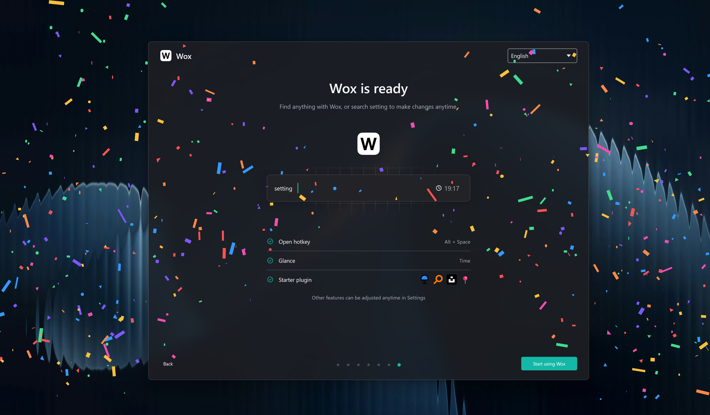

  

## A launcher that stays out of your way

Wox is a **fully native**, open-source launcher for macOS, Linux, and Windows — with GPU rendering on every platform. Everyday use typically stays around **~150 MB of memory**, so it can live in the background without feeling like another heavy desktop app.

Local search, keyboard-first actions, and an extensible plugin system stay in one focused input.

[Download Wox](https://github.com/Wox-launcher/Wox/releases) · [Browse plugins](https://www.woxlauncher.com/store/plugins) · [Read the docs](https://www.woxlauncher.com/)

> Press <kbd>Alt</kbd>/<kbd>Command</kbd> + <kbd>Space</kbd>, type what you need, and press <kbd>Enter</kbd>.

https://github.com/user-attachments/assets/15ad1370-bbc0-4f96-8729-56fcc769c41c

## Why Wox

| | |
| --- | --- |
| **Fully native** | Full native GPU rendering on macOS, Linux, and Windows — not Electron, not a browser shell. |
| **~150 MB memory** | Built to stay light while idle and during everyday queries, so the launcher can stay resident without taxing the machine. |
| **Keyboard-first** | Open apps, find files, run actions, and finish the next step without leaving the input. |
| **Plugin-driven** | Start with built-ins, then extend with Node.js, Python, or script plugins from the store. |

## Install

| Platform | Method | Command or instructions |
| --- | --- | --- |
| macOS | Homebrew | `brew install --cask wox` |
| Windows | Winget | `winget install -e --id Wox.Wox` |
| Windows | Scoop | `scoop install extras/wox` |
| Windows | Chocolatey | `choco install wox` |
| Arch Linux | AUR | `yay -S wox-bin` |
| Debian / Ubuntu | `.deb` | Download `wox-linux-amd64.deb` from [Releases](https://github.com/Wox-launcher/Wox/releases), then `sudo apt install ./wox-linux-amd64.deb` |
| Fedora / RHEL | `.rpm` | Download `wox-linux-amd64.rpm` from [Releases](https://github.com/Wox-launcher/Wox/releases), then `sudo dnf install ./wox-linux-amd64.rpm` |
| openSUSE | `.rpm` | Download `wox-linux-amd64.rpm` from [Releases](https://github.com/Wox-launcher/Wox/releases), then `sudo zypper install ./wox-linux-amd64.rpm` |
| macOS / Linux / Windows | Manual | Download the latest stable package from [Releases](https://github.com/Wox-launcher/Wox/releases) and run it directly |

## Documentation

- [Project documentation](https://www.woxlauncher.com/)
- [Plugin store](https://www.woxlauncher.com/store/plugins)
- [Theme store](https://www.woxlauncher.com/store/themes)

## Contributing

Contributions are welcome through issues, discussions, and pull requests.

- [Discussions](https://github.com/Wox-launcher/Wox/discussions)
- [Reddit](https://www.reddit.com/r/WoxLauncher/)
- [Issues](https://github.com/Wox-launcher/Wox/issues)
- [Pull requests](https://github.com/Wox-launcher/Wox/pulls)

## Sponsors

<table>
  <tr>
    <td width="60" align="center">
      
    </td>
    <td>
      Free code signing on Windows provided by <a href="https://signpath.io">SignPath.io</a>, with certificates from <a href="https://signpath.org">SignPath Foundation</a>.
    </td>
  </tr>
</table>

## Project Activity

