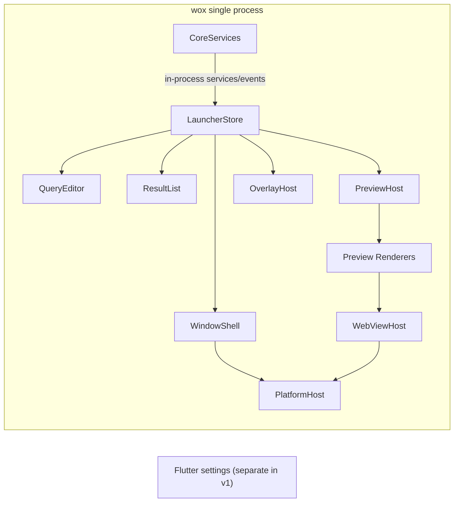

# Launcher Runtime Design

## Problem
Wox currently ships the launcher window on top of Flutter while `wox.core` already owns most query, result, preview, and window-control behavior through HTTP and WebSocket APIs. This split works, but the launcher path now carries runtime concerns that are more specialized than a general desktop UI:

- high-frequency query updates and incremental result flushes
- strict keyboard-first focus rules
- window show/hide and positioning behavior tied to platform shell APIs
- preview rendering for multiple content types
- embedded WebView preview with session reuse, navigation controls, and escape fallback

For the launcher window, this is closer to a dedicated runtime than a general-purpose UI surface.

## Scope
This document covers a **new launcher-only runtime** that replaces the Flutter launcher window while keeping the existing Flutter settings window.

The chosen architecture in this revision is:
- launcher and `wox.core` move into one Go process
- launcher UI is hosted by platform-native UI layers inside that process
- Flutter settings remain separate in v1

In scope:
- query box, result list, preview pane, and launcher overlays
- existing preview protocol compatibility
- native WebView embedding on Windows, macOS, and Linux
- launcher state machine, focus rules, and migration strategy

Out of scope:
- settings window replacement
- plugin protocol redesign
- theme-store or settings-page UI reimplementation
- building a generic cross-platform GUI toolkit

## Goals
- Keep `wox.core` and plugin behavior stable by preserving the current launcher-facing semantics.
- Build a runtime specialized for Wox launcher semantics instead of a generic widget framework.
- Support the existing preview model, including `webview`, `terminal`, and remote preview loading.
- Support native embedded webviews on:
  - Windows via `WebView2`
  - macOS via `WKWebView`
  - Linux via `WebKitGTK`
- Preserve keyboard-first behavior and window-management behavior across platforms.

## Non-Goals
- No attempt to create a `fyne`-like general GUI abstraction for arbitrary applications.
- No attempt to unify launcher UI and settings UI into one rendering stack in v1.
- No plugin-defined custom preview views.

## Constraints And Existing Facts
- `wox.core` already defines a launcher preview protocol with multiple preview types, not just text and markdown.
- Preview payloads can be replaced with `remote` references when the inline payload is too large.
- The current Flutter launcher already treats `webview` preview as a specialized runtime concern with session handling and toolbar actions.
- Windows already has a concrete cached WebView session model.
- macOS currently exposes command hooks for WebView actions but does not yet provide the same session model.
- Linux currently has no equivalent embedded WebView implementation in the Flutter launcher path.

Relevant current code:
- preview protocol: `wox.core/plugin/preview.go`
- launcher preview rendering: `wox.ui.flutter/wox/lib/components/wox_preview_view.dart`
- current WebView platform bridge: `wox.ui.flutter/wox/lib/utils/webview/wox_webview_util.dart`
- Windows WebView session model: `wox.ui.flutter/wox/lib/utils/webview/windows/wox_windows_webview_platform.dart`

Additional launcher-facing UI surfaces already exist in `wox.core`:
- backend-to-UI methods such as `ChangeQuery`, `RefreshQuery`, `ShowApp`, `HideApp`, `ToggleApp`, `ChangeTheme`, `PickFiles`, `ShowToolbarMsg`, `ClearToolbarMsg`, `UpdateResult`, `PushResults`, `OpenSettingWindow`, and chat-related refresh hooks
- UI-to-backend websocket methods such as `Query`, `QueryMRU`, `Action`, `FormAction`, `ToolbarMsgAction`, `TerminalSubscribe`, `TerminalUnsubscribe`, `TerminalSearch`, and `Log`
- HTTP callbacks and endpoints such as `/preview`, `/query/metadata`, `/plugin/detail`, `/on_ui_ready`, `/on_show`, `/on_hide`, `/on_focus_lost`, and `/on_query_box_focus`

These existing WS/HTTP surfaces are important as migration references, but in the target single-process design they become in-process service methods and lifecycle hooks rather than launcher runtime network traffic.

## Why Not Build A Smaller Fyne
`fyne` is a cross-platform GUI toolkit with general abstractions for windows, canvas objects, widgets, layout, and rendering drivers. That is the right shape for a reusable GUI framework.

Wox launcher does not need that shape.

What Wox needs is:
- one fixed window layout
- one fixed interaction model
- one fixed result protocol
- one fixed preview runtime with a few specialized renderers

If we generalize too early, the project will drift toward maintaining a second general UI framework. That increases scope without helping the launcher problem.

The recommended direction is therefore a **Wox Launcher Runtime**, not a general toolkit.

## Proposed Architecture
The new runtime keeps `wox.core` as the backend authority and replaces only the launcher rendering and platform integration layer.

### Technology Selection
The launcher runtime should use:

- `Go` for the runtime core, state machine, core-integration layer, layout engine, and preview orchestration
- a custom retained-mode launcher scene instead of a generic widget toolkit
- thin platform-native host layers for:
  - window creation and composition
  - IME and text input integration
  - native file dialogs
  - embedded webview hosting

This document explicitly does **not** recommend `fyne`, `gio`, or another general widget framework as the launcher foundation. Those frameworks solve a broader problem than Wox needs and would reintroduce general widget abstractions the design is trying to avoid.

The chosen implementation shape is therefore:
- shared launcher logic in Go
- platform-specific host code in:
  - C++ on Windows
  - Objective-C or Objective-C++ on macOS
  - C with GTK bindings on Linux

### Process Model
The launcher and `wox.core` should live inside a **single Go process**.

Reasons:
- it removes launcher-to-core IPC for the primary UI path
- it reduces synchronization latency between query execution and launcher state updates
- it keeps the native window host, webview host, and launcher state machine in one address space
- it still allows a separate settings process in v1 without forcing the launcher down the same path

Implications:
- the `wox` executable owns both core services and launcher UI services
- launcher-to-core interaction becomes in-process interfaces, channels, and lifecycle hooks
- Flutter settings remain a separate frontend process in v1
- existing WS/HTTP surfaces remain relevant only for the separate settings frontend and for migration reference, not as the target launcher path

### Thread Model
Single-process does **not** remove native UI thread constraints.

Required thread rules:
- `main()` locks the initial OS thread with `runtime.LockOSThread()`
- the native UI host runs on that locked main thread
- all native UI operations, including:
  - window creation
  - text-input host updates
  - webview creation
  - webview navigation commands
  - child-host attach or detach
  must execute on the UI thread
- `wox.core` query execution, plugin work, indexing, and I/O continue on background goroutines
- background goroutines communicate back to the UI thread through a bounded dispatch queue

Platform-specific constraints:
- Windows
  - the UI thread must satisfy Win32 message-loop requirements and `WebView2` STA expectations
- macOS
  - AppKit and `WKWebView` must stay on the main thread
- Linux
  - GTK and `WebKitGTK` stay on the GTK main-loop thread

### In-Process Boundary
The architectural boundary is no longer process-to-process. It becomes:

- `CoreServices`
  - query lifecycle
  - plugin execution
  - preview payload generation
  - settings
  - launcher commands
- `LauncherHost`
  - state store
  - scene construction
  - focus
  - input routing
  - preview lifecycle
- `PlatformHost`
  - native windowing
  - text input bridge
  - file dialogs
  - webview hosting

Communication patterns:
- synchronous service calls for short control operations
- asynchronous event streams for query results, terminal chunks, and incremental updates
- explicit marshaling onto the UI thread for any native UI mutation

### Top-Level Split
- single `wox` process
  - `CoreServices`
    - owns query lifecycle, plugins, result generation, preview payloads, settings, and launcher commands
  - `LauncherHost`
    - owns rendering, focus, input routing, preview renderer lifecycle, native window behavior, and native webview embedding
  - `PlatformHost`
    - owns native message loop, IME bridge, webview host, and dialog services
- `Flutter settings`
  - remains unchanged in v1

### Runtime Modules
- `LauncherStore`
  - single source of truth for launcher state
- `WindowShell`
  - owns top-level window creation, visibility transitions, size, positioning, transparency, and platform shell integration
- `QueryEditor`
  - owns text input, IME integration, caret and selection behavior
- `ResultList`
  - owns result virtualization, selection, incremental reconciliation, and keyboard navigation
- `PreviewHost`
  - resolves and mounts preview renderers
- `OverlayHost`
  - owns action panel, form overlay, and fullscreen preview overlay behavior
- `PlatformHost`
  - exposes platform-specific services for focus, clipboard, theme changes, system appearance, and launcher window hooks
- `WebViewHost`
  - owns native webview sessions, active webview routing, navigation state, and platform webview backends

### Architecture Diagram

## Rendering Architecture
The launcher runtime needs an explicit rendering stack. The runtime is not complete if it defines state and layout without defining how pixels reach the screen.

### Rendering Stack Choice
V1 should use a **shared Skia-based renderer** for launcher chrome and non-webview content.

Reasoning:
- it gives one cross-platform drawing model for rounded rects, shadows, clipping, images, and text
- it avoids three divergent native text-and-paint implementations for the fixed launcher UI
- it keeps list rendering, badges, and theme behavior consistent across platforms
- it is a better fit than `Cairo + Pango` for Windows packaging and than fully native controls for visual consistency
- it avoids re-implementing text shaping from scratch, because Skia already integrates paragraph and shaping support

Rejected baseline approaches:
- fully native view rendering
  - rejected because Wox launcher visuals and truncation rules would drift across three platforms
- native list controls plus custom cells
  - rejected for v1 because they complicate exact theme parity, tail-badge layout, and keyboard behavior consistency
- full custom GPU renderer with self-managed shaping
  - rejected because text shaping and rich image support are too expensive for the launcher scope

### Surface And Composition Model
The runtime should compose two rendering domains:

- `Skia scene`
  - query box
  - result list
  - overlays
  - toolbars
  - plain text preview
  - structured cards such as update or plugin detail
- `native child surfaces`
  - embedded website preview
  - markdown document preview rendered through a lightweight document webview

This yields one consistent renderer for fixed launcher chrome while reserving webview composition for content that is naturally document-like.

### Platform Raster Backends
- Windows
  - Skia on `D3D11` with native window composition integration
- macOS
  - Skia on `Metal`
- Linux
  - Skia on `OpenGL` in the GTK host, with CPU fallback for unsupported GPU environments and CI

The native host remains responsible for the top-level render loop, swap chain or backing layer lifecycle, transparency, and child-webview z-order management.

### Go-To-Renderer Contract
Go does **not** rasterize pixels directly.

Go owns:
- launcher state
- box-level layout
- scene-tree construction
- resource identity and invalidation
- hit-test region ownership

The native renderer owns:
- Skia surface lifecycle
- paragraph shaping and final text rasterization
- image decode and texture upload
- clip, shadow, and rounded-rect drawing
- final frame presentation

The contract between them should be a retained scene description, for example `LauncherFrame`, containing:
- visual nodes
  - fills
  - strokes
  - rounded rectangles
  - shadows
  - text blocks
  - image draws
  - clips
- interactive regions
  - node id
  - bounds
  - cursor or focus affordance
- child-host reservations
  - preview-pane bounds for active webview sessions

### Text Shaping And Layout Strategy
The shared renderer should use:
- `SkParagraph`
- `HarfBuzz`
- `ICU`

Responsibilities:
- CJK shaping and line breaking
- emoji fallback and mixed-script rendering
- RTL support
- ellipsis and multi-line truncation
- paragraph measurement for title, subtitle, tail badges, and tooltip content

Layout flow:
- Go requests text measurement from the renderer through a `TextMetricsBridge`
- Go computes box layout using measured sizes
- Go emits the final scene description
- native renderer performs the final paragraph paint within the provided bounds

This keeps layout logic in shared Go code without forcing Go to own glyph shaping.

### Query Editor Rendering Strategy
The query box should be visually rendered by the Skia scene, but composing text input must still be driven by a platform-native IME bridge.

That means:
- caret, background, border radius, and selection visuals are part of the launcher scene
- composition text, candidate windows, and IME focus ownership remain native
- the native text-input bridge mirrors composed text and ranges back into the query scene

### Markdown Strategy
V1 markdown should **not** be implemented as a custom rich-text renderer.

Instead, `MarkdownRenderer` should use a **sandboxed document webview** built on `WebViewHost`.

Pipeline:
- Go converts markdown to HTML using `goldmark`
- renderer injects HTML into a local document template
- the document template supplies:
  - syntax highlighting
  - table styling
  - link handling
  - image layout
  - optional KaTeX support for parity with current markdown usage

Why this is the preferred v1 trade-off:
- it avoids building a second rich-text engine beside the launcher renderer
- it preserves most current markdown capabilities with less custom paint code
- it reuses the already-required native webview subsystem

Guardrails:
- markdown document webviews use a distinct local template profile, not a browsing session profile
- external links open out of process rather than navigating the preview pane away from its template
- markdown webviews are considered document previews, not general browsing sessions

### Plain Text Strategy
Plain text preview should use the shared Skia renderer, not a webview.

This keeps simple preview fast, cheap, selectable, and independent from webview startup cost.

### Image Strategy
The runtime needs an explicit image support matrix because image rendering is part of both result rows and preview content.

V1 launcher-side image support:
- `url`
  - supported
- `absolute`
  - supported
- `base64`
  - supported
- `svg`
  - supported through Skia SVG rasterization
- `emoji`
  - supported through shared text shaping
- `theme`
  - supported by rendering the theme preview icon from parsed theme data in the launcher scene

Normalized before render:
- `relative`
  - convert to absolute path before scene creation
- `fileicon`
  - resolve to an absolute icon path or raster before scene creation

Deferred or degraded in v1:
- `lottie`
  - not required for launcher v1 parity
  - degrade to a static placeholder or first-frame fallback if encountered

### Result List Rendering Strategy
The result list should remain a **shared custom virtualized list**, not a platform-native list control.

Reasons:
- exact theme parity matters for active and inactive states
- result rows have Wox-specific fixed layout with tails, badges, shortcut hints, and quick-select numbers
- virtualization behavior needs to stay consistent across platforms
- keyboard-first interaction is easier to keep identical in one renderer

The fixed row shape reduces complexity enough that custom shared rendering is justified here, unlike markdown.

### Theme Token Strategy
The runtime should continue to load the current theme JSON from `wox.core`, but it should map raw theme fields into a smaller renderer-facing token set.

Layers:
- `TransportTheme`
  - raw theme payload from `wox.core`
- `PaintTheme`
  - parsed colors, radii, paddings, and typography metrics used by the renderer

`PaintTheme` must cover launcher-visible theme fields, including:
- app background
- query box colors and radii
- result row spacing, active state, and left border width
- preview text and divider colors
- toolbar colors
- action overlay colors

This keeps theme compatibility while preventing render code from depending on raw JSON keys directly.

## Core/Launcher Interface Compatibility
The runtime should remain semantically compatible with the existing launcher path even though the primary launcher path is no longer network-based.

### Protocol Rules
- Reuse the existing query, action, and preview semantics.
- Reuse the existing preview type model, including:
  - `markdown`
  - `text`
  - `image`
  - `url`
  - `file`
  - `remote`
  - `terminal`
  - `webview`
  - internal structured preview types such as `plugin_detail`, `chat`, and `update`
- Reuse remote preview semantics for large payloads, but implement them as in-process deferred resolvers rather than launcher HTTP fetches.

### Compatibility Principle
The launcher host should behave like an in-process client of `wox.core` semantics, not as a redesign of `wox.core`.

That keeps plugin behavior stable and limits the migration surface.

### Core/Launcher Interface Inventory
The implementation plan should treat the following launcher-facing surfaces as explicit scope.

Core-to-launcher events or callbacks:
- launcher window control
  - `ShowApp`
  - `HideApp`
  - `ToggleApp`
  - `ChangeQuery`
  - `RefreshQuery`
- result and preview updates
  - `UpdateResult`
  - `PushResults`
  - `ShowToolbarMsg`
  - `ClearToolbarMsg`
- theme and dialog coordination
  - `ChangeTheme`
  - `OpenSettingWindow`
- phase-gated chat operations
  - `FocusToChatInput`
  - `SendChatResponse`
  - `ReloadChatResources`
- settings-window coordination hooks
  - `ReloadSettingPlugins`
  - `ReloadSetting`

Launcher-to-core service calls:
- query and execution
  - `Query`
  - `QueryMRU`
  - `Action`
  - `FormAction`
  - `ToolbarMsgAction`
- preview and metadata lookup
  - `ResolvePreview`
  - `GetQueryMetadata`
  - `GetPluginDetail`
- terminal preview operations
  - `TerminalSubscribe`
  - `TerminalUnsubscribe`
  - `TerminalSearch`
- diagnostics
  - `Log`

Launcher lifecycle hooks:
- `OnUIReady`
- `OnShow`
- `OnHide`
- `OnFocusLost`
- `OnQueryBoxFocus`

### Internal Interface Shape
The single-process launcher path should expose coarse-grained Go interfaces, not high-frequency cgo paint calls.

Recommended service split:
- `LauncherCoreAPI`
  - synchronous query or action entry points
- `LauncherEventBus`
  - async result snapshots, terminal chunks, and incremental preview updates
- `UIThreadDispatcher`
  - marshals work from goroutines to the native UI thread

The current WS/HTTP message list remains useful as a semantic checklist, but the target implementation should not serialize these calls for the integrated launcher path.

### Platform Dialog Services
`PickFiles` remains in scope for the launcher runtime. It should be implemented in `PlatformHost` using native file-selection dialogs on each platform rather than delegated back into Flutter.

`OpenSettingWindow` should launch or focus the existing Flutter settings frontend instead of being treated as a no-op.

### Phase Compatibility Notes
- Before terminal preview lands, launcher builds using the new runtime must either:
  - remain in development-only builds
  - or render a reduced terminal fallback card that makes the missing live terminal behavior explicit
- Chat-specific inbound methods should remain phase-gated with the `ChatRenderer` work and should not be silently dropped once the integrated launcher is release-ready

## Preview Runtime
Preview handling should be moved out of the root view and treated as its own runtime subsystem.

### PreviewResolver
`PreviewResolver` transforms `WoxPreview` into a resolved runtime model.

Responsibilities:
- unwrap `remote` preview payloads
- cancel stale preview requests when selection changes
- normalize preview types into renderer-ready data
- produce loading and error states

### Resolved Preview Model
Do not pass raw preview strings directly into the final renderer path. Normalize them into typed runtime models:

- `TextPreview`
- `MarkdownPreview`
- `ImagePreview`
- `FilePreview`
- `TerminalPreview`
- `WebViewPreview`
- `PluginDetailPreview`
- `UpdatePreview`
- `ChatPreview`

Normalization rules:
- `url` resolves to `WebViewPreview` with default navigation policy and no injected CSS.
- `webview` resolves to `WebViewPreview` with the explicit embedded-webview payload from `WoxPreviewWebviewData`.
- `remote` resolves first, then re-enters the same normalization path as the fetched payload.
- `plugin_detail`, `update`, and `chat` resolve to distinct structured preview models, not one shared opaque card payload.

### PreviewRenderer Contract
Each renderer implements a lifecycle contract rather than only `render()`:

- `mount(host)`
- `update(preview)`
- `focus()`
- `blur()`
- `handleKey(event)`
- `supportsFullscreen()`
- `wantsExclusivePointer()`
- `unmount()`

This keeps preview-specific behavior out of the launcher root state machine.

### Renderer Set
The runtime should ship a fixed renderer set:

- `PlainTextRenderer`
  - handles `text` through the shared Skia renderer
- `MarkdownRenderer`
  - handles markdown through a document-scoped webview template layered on `WebViewHost`
- `FileRenderer`
  - dispatches by file type to markdown, image, PDF, code, or plain text sub-renderers
- `TerminalRenderer`
  - handles terminal preview and custom scroll behavior
- `WebViewRenderer`
  - handles native webview session attach and toolbar integration
- `PdfRenderer`
  - handles PDF preview through a native document-preview path where supported
- `PluginDetailRenderer`
  - handles plugin metadata cards
- `UpdateRenderer`
  - handles update status and progress cards
- `ChatRenderer`
  - handles structured chat preview and streaming update semantics

### FileRenderer V1 Support Matrix
`FileRenderer` should have an explicit v1 support set for effort estimation.

Markdown:
- `.md`

Images:
- `.png`
- `.jpg`
- `.jpeg`
- `.gif`
- `.bmp`
- `.webp`
- `.svg`

Documents:
- `.pdf`

Code and text:
- `.txt`
- `.conf`
- `.json`
- `.toml`
- `.ini`
- `.xml`
- `.yaml`
- `.yml`
- `.js`
- `.ts`
- `.py`
- `.sh`
- `.go`
- `.rs`
- `.c`
- `.cc`
- `.cpp`
- `.h`
- `.hpp`
- `.cs`

Other file types fall back to an unsupported-file preview message in v1.

Dispatch rules:
- `.md` routes to `MarkdownRenderer`
- image file types route to `ImagePreview`
- `.pdf` routes to `PdfRenderer`
- code and text file types route to a plain-text or code file renderer within the shared Skia scene

PDF rules:
- use a native document-preview path where the platform webview or document layer supports inline PDF rendering
- fall back to explicit external-open behavior on unsupported environments rather than blocking the launcher

Code file rules:
- v1 requires readable text, scrolling, selection, and basic monospaced presentation
- syntax highlighting for code files is a stretch goal for v1, not a parity requirement

## WebView Design
WebView support is the highest-complexity part of the launcher runtime and must be a first-class subsystem.

### Platform Backends
- Windows: `WebView2`
- macOS: `WKWebView`
- Linux: `WebKitGTK`

Linux support assumes the system dependency on `WebKitGTK` is acceptable.

Platform-specific bridge rules:
- Windows
  - use the existing `WebView2`-style cached session model as the reference backend
- macOS
  - use `WKUserContentController` for script injection, message handlers, escape fallback, and navigation event bridging
  - use `evaluateJavaScript` only for one-shot imperative commands such as refresh or history navigation
- Linux
  - use `WebKitGTK` with GTK-hosted child views and an explicit compositor test matrix for X11 and Wayland

### Session Model
WebView should use explicit sessions rather than stateless view recreation.

Each `WebViewSession` owns:
- navigation state
- runtime-specific controller or native view handle
- cache identity
- injected CSS state
- JS bridge registration
- escape fallback bridge

### Session Lifecycle
- `Acquire(preview)`
  - create or reuse a session based on cache policy and cache key
- `Attach(session, hostRect)`
  - bind the session to the visible preview pane
- `Activate(session)`
  - make the session the active target for toolbar and key routing
- `Detach(session)`
  - remove the session from the current pane without destroying cached state
- `Release(session)`
  - destroy transient sessions or evicted cached sessions

### Session Cache Rules
- Cache key should be derived from URL, injected CSS, and cache policy.
- `cacheDisabled=true` always produces a transient session.
- Cached sessions survive launcher hide/show unless memory pressure or explicit eviction requires cleanup.

### Linux Backend Guardrail
If embedded `WebKitGTK` proves unstable on a specific Linux compositor or distribution at runtime, the launcher should fail gracefully for that preview instance by:
- showing a degraded preview state
- keeping the launcher responsive
- exposing an explicit "open in browser" path

This is a runtime fallback for unsupported environments, not the preferred steady-state behavior.

### WebView Interaction Rules
V1 must support:
- embedded display
- refresh
- go back
- go forward
- open inspector where supported
- active-session routing
- escape fallback to launcher
- focus switching between webview and launcher controls

### Escape And Focus Chain
Keyboard routing for `Esc` should be:

1. overlay
2. active webview
3. active preview renderer
4. launcher fallback

Launcher fallback behavior:
- if the query box is visible and should regain focus, focus query
- otherwise hide the launcher

### Design Principle
The runtime must never attempt to redraw webpage content into a generic canvas renderer. Native webviews remain native child hosts.

## Launcher State Machine
Launcher behavior should be implemented as a strict state machine instead of view-local booleans.

### Core State Groups
- `visibility`
  - `hidden`
  - `showing`
  - `visible`
  - `hiding`
- `mode`
  - `normal`
  - `preview_fullscreen`
  - `action_panel`
  - `form_overlay`
- `focusTarget`
  - `query`
  - `result_list`
  - `preview`
  - `overlay`
- `querySession`
  - `queryId`
  - `revision`
  - `isFinal`
  - `selectedResultId`
- `previewSession`
  - `token`
  - `phase`
  - `rendererId`
  - `attachedWebViewSessionId`

`previewSession.phase` values:
- `idle`
- `loading`
- `ready`
- `error`

### Required State Invariants
- Query updates and preview updates must be versioned independently.
- Preview resolution must only commit if the preview token still matches the selected result.
- A result-list selection change must immediately invalidate stale preview work.
- WebView attach and detach must track the same preview token as the selected result.

Token rule:
- `querySession.revision` is a monotonic counter per query lifecycle
- `previewSession.token` is a monotonic counter per preview request
- each preview request also carries a derived `previewIdentity = hash(queryId, resultId, previewType, previewDataHash)`
- a preview commit is valid only if both:
  - `previewSession.token` is still current
  - `previewIdentity` still matches the selected result

### State Transitions
- `ShowApp`
  - enter `visible + normal + focus=query`
- `HideApp`
  - blur or detach renderers, hide the window, preserve cached resources
- `QueryChanged`
  - create a new query revision, invalidate preview work, keep list reconciliation separate
- `ResultsFlushed`
  - reconcile result items, preserve selection if identity still exists
- `SelectionChanged`
  - create a new preview token and trigger preview resolution
- `PreviewResolved`
  - mount only if the token still matches the current selection
- `OpenActionPanel`
  - enter overlay mode without losing current selection
- `OpenFormOverlay`
  - freeze background preview updates while overlay is active

### Mode Transition Matrix
Legal mode transitions:
- `normal -> action_panel`
- `action_panel -> normal`
- `normal -> preview_fullscreen`
- `preview_fullscreen -> normal`
- `action_panel -> form_overlay`
- `form_overlay -> action_panel`
- `form_overlay -> normal`

Disallowed direct transitions:
- `preview_fullscreen -> action_panel`
- `preview_fullscreen -> form_overlay`

These must first return to `normal`.

Visibility transitions:
- `hidden -> showing` on `ShowApp`
- `showing -> visible` on native shown or ready callback
- `visible -> hiding` on `HideApp` or blur-driven hide
- `hiding -> hidden` on native hidden callback
- `hiding -> showing` on a new `ShowApp`

When `hiding -> showing` happens, pending hide completion must be canceled and the latest show context must win.

## Input Routing
Launcher input must be centrally routed.

### Event Priority
Events should be offered in this order:

1. overlay
2. active webview
3. active preview renderer
4. result list
5. query editor
6. window-level command handler

### Keyboard Rules
- `Esc`
  - overlay close, then webview fallback, then preview fallback, then query focus, then launcher hide
- `Enter`
  - execute current result default action
- Primary modifier + `J`
  - toggle action panel while preserving selection
- `Tab` and `Shift+Tab`
  - cycle focus between query, results, preview, and overlay
- arrow keys
  - drive result selection by default
- text input
  - should flow back to query editor unless the current preview has exclusive input focus

### IME Requirement
IME behavior must be owned by `QueryEditor` and not depend on incidental platform widget focus behavior.

### QueryEditor Input Strategy
`QueryEditor` should not reimplement low-level IME protocols from scratch in v1.

Instead:
- the visible query box is rendered by the launcher runtime
- composing state is owned by a platform-native text input bridge
- the native bridge mirrors text, selection, and composition ranges into the rendered query box

Platform bridges:
- Windows
  - TSF-capable native text input host on the UI thread
- macOS
  - `NSTextInputClient`-compatible host on the main thread
- Linux
  - `gtk_im_context`-backed input host integrated with the GTK loop

This keeps candidate windows, composing state, and CJK IME behavior in native input systems while preserving the custom launcher appearance.

## Result List And Preview Coordination
Result list and preview need explicit coordination rules to avoid stale or flickering content.

### Identity Rules
Preview identity should be:
- `queryId`
- `resultId`
- `previewType`
- `previewDataHash`

Only identity changes should trigger renderer replacement.

### Coordination Rules
- Selection change should not recreate the whole list.
- Preview should scroll inside its own pane and should not drive launcher window height.
- Launcher auto-resize should depend on query box, toolbar, and result-count rules, not preview content.
- Remote preview and webview preview both require cancellation-safe async resolution.
- Overlay open should freeze preview churn underneath it.

## Theming
The runtime should reuse existing launcher theme semantics rather than invent a second theme model.

V1 should support:
- foreground and background colors
- result selection styling
- preview text and divider colors
- toolbar and overlay colors
- light and dark appearance changes

Theme input should still come from `wox.core`.

## Migration Strategy
Migration should be incremental and semantically compatible with the current launcher behavior.

### Phase 0: Rendering Spike
Before broad implementation work, run a rendering spike on Windows using the chosen render stack.

Required spike outputs:
- one themed query box
- one virtualized result list with:
  - icon
  - title
  - subtitle
  - tail badges
  - quick-select number
- one markdown preview rendered through the document-webview pipeline
- one plain-text preview rendered through the shared Skia pipeline

Questions this spike must answer:
- is text quality acceptable compared to the current Flutter launcher
- are CJK and emoji shaping acceptable
- is theme fidelity acceptable for launcher-critical fields
- is markdown-via-webview latency acceptable
- is the Go-to-renderer interface small enough to remain maintainable

Exit criteria:
- the team can compare screenshots and latency traces against the current launcher
- the render stack is confirmed or rejected before the implementation plan locks in milestone estimates

### Startup Failure Strategy
The packaged product should ship only one launcher path:
- `integrated native launcher`

If the integrated launcher fails to initialize:
- surface a clear diagnostic message
- write startup diagnostics to the existing log location
- exit cleanly or enter an explicit diagnostic mode

The product should not silently fall back to a second launcher implementation.

### Phase 1: Freeze Launcher Contract
- freeze the semantic launcher contract before replacing transport boundaries
- do not redesign plugin contracts
- do not redesign preview payload types

Exit criteria:
- all launcher-facing protocol surfaces are cataloged
- all phase ownership decisions are documented
- in-process `LauncherCoreAPI` and `LauncherEventBus` interfaces are defined
- the UI-thread dispatcher contract is defined

### Phase 2: Build The Minimum Shell
Implement:
- `WindowShell`
- `QueryEditor`
- `ResultList`
- `PreviewHost`

Preview support in this phase:
- `text`
- `markdown`
- `image`
- `file`

Success criteria:
- show and hide are stable
- incremental result flush is stable
- selection and preview invalidation are stable
- `PickFiles` and `OpenSettingWindow` work through `PlatformHost`
- query-box IME composition works on at least one CJK input method per platform
- launcher and core communicate without launcher-path WS/HTTP

### Phase 3: Add WebViewHost
Implement platform webview backends with one shared session abstraction.

Recommended implementation order:
1. Windows
2. macOS
3. Linux

This order matches current implementation maturity.

Exit criteria:
- cached and transient webview sessions both work on Windows and macOS
- Linux webview backend passes the compositor smoke matrix or enters explicit degraded fallback on unsupported environments
- focus and `Esc` routing work with embedded webviews

### Phase 4: Add Structured Preview Types
Implement:
- `terminal`
- `plugin_detail`
- `update`
- `chat`

Exit criteria:
- terminal subscribe, unsubscribe, search, chunk streaming, and state updates work end to end
- chat preview methods are wired only once `ChatRenderer` semantics match backend expectations
- structured preview regressions are covered by launcher smoke scenarios

### Phase 5: Ship Integrated Launcher
- launcher uses the integrated native runtime
- settings continue using Flutter

Exit criteria:
- packaged builds ship only the integrated launcher path
- settings remain reachable through the separate Flutter settings frontend
- integrated launcher startup diagnostics are documented and testable

## Proof Of Concept Scope
The first proof of concept should validate behavior, not polish.

### PoC Features
- show and hide the launcher window
- query input and incremental result updates
- result selection changes
- preview resolution and cancellation
- native embedded webview
- session cache and attach or detach behavior
- escape fallback from webview to launcher

### PoC Success Criteria
- repeated query updates do not flicker or desynchronize selection
- preview does not show stale content after fast selection changes
- cached webview sessions survive hide and show cycles
- `Esc`, `Tab`, arrows, and `Enter` behave consistently

### PoC Performance Baselines
The PoC should capture concrete UI-side latency targets:

- after a query-result snapshot arrives from `wox.core`, visible list reconciliation should complete within:
  - `<= 16 ms` median
  - `<= 33 ms` p95
- after selection changes to an inline preview, placeholder or loading-state swap should occur within one frame
- after selection changes to a cached webview preview, attach and first stable paint should complete within:
  - `<= 100 ms` median on warm cache
- after selection changes to a non-webview inline preview, final render should complete within:
  - `<= 50 ms` median

These budgets measure launcher-side work after data is available. They do not include plugin execution or network latency outside the launcher runtime.

### PoC Rendering Validation
In addition to behavior validation, the PoC should verify rendering quality for:
- CJK query text and result text
- mixed emoji and text rendering
- active and inactive result-row theme fidelity
- rounded corners, shadows, and translucent surfaces
- markdown code blocks, tables, and link handling through the document-webview path
- markdown preview latency relative to plain-text preview

## Validation Plan
### Manual Validation
- repeated fast typing
- repeated result-count growth and shrink cycles
- switching across many preview-bearing results
- opening and closing action panel and form overlay
- hiding and reopening the launcher while a cached webview preview is selected
- switching between query focus and webview focus repeatedly

### Platform Validation
- Windows with and without `WebView2` runtime available
- macOS with `WKWebView`
- Linux distributions with required `WebKitGTK` runtime available
- Linux on both X11 and Wayland where supported by the target distribution

### Stress Validation
- at least 100 consecutive selection changes across mixed preview types
- at least 50 hide and show cycles with a cached webview preview
- at least 20 rapid query revisions while results flush incrementally

## Risks
- Native webview embedding may introduce z-order, clipping, or resize edge cases.
- IME behavior may regress if focus routing is not owned centrally.
- Linux embedded `WebKitGTK` is a high-risk area because compositor behavior, child embedding, focus routing, and resize behavior can vary across X11 and Wayland environments.
- Linux support will carry ongoing runtime dependency support costs because `WebKitGTK` is external.
- Single-process integration removes crash isolation between launcher UI and core services.
- Single-process integration requires strict UI-thread discipline so plugin or query work never blocks the native host loop.
- cgo bridge boundaries can become a maintainability problem if scene submission or text measurement calls are too fine-grained.
- The runtime can accidentally grow into a general toolkit if renderer boundaries are not kept strict.
- Dual frontend maintenance adds short-term operational cost.

## Recommended Direction
Build a **Wox Launcher Runtime** with these boundaries:

- launcher-only
- single-process with `wox.core`
- semantic compatibility with existing launcher behavior
- fixed semantic components instead of generic widgets
- native webview backends per platform
- Flutter retained for settings only

This gives Wox a runtime specialized for its launcher behavior without expanding scope into a second general GUI framework or preserving launcher IPC as a permanent requirement.

## Follow-Up Work
After this design is approved, the next document should be an implementation plan covering:
- repository layout for the new runtime
- platform abstraction boundaries
- milestone breakdown
- smoke-test strategy
