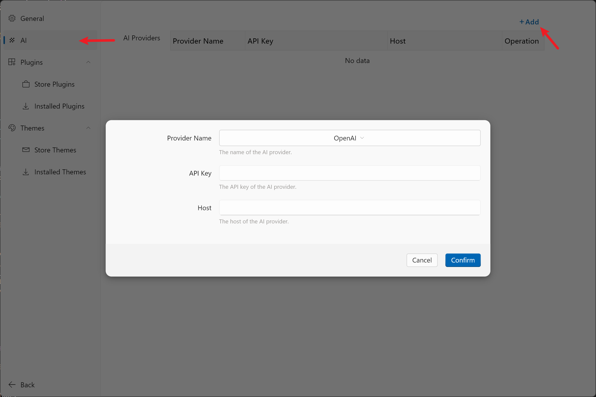

# AI Settings

To use Wox's AI features (such as AI theme generation and automatic Git commit message generation), you need to configure your AI provider settings first.

## Configuration Steps

1. Open Wox settings
2. Select "AI" from the left sidebar
3. Click the "+ Add" button in the top right corner
4. Fill in the following information in the popup dialog:

   - **Provider Name**: Choose your AI provider (e.g., OpenAI)
   - **API Key**: Enter your API key
   - **Host**: (Optional) Enter your custom API endpoint if you're using Ollama

5. Click "Confirm" to save the settings

## Getting API Keys

### OpenAI

1. Visit [OpenAI API Keys](https://platform.openai.com/account/api-keys)
2. Sign in to your OpenAI account
3. Click "Create new secret key"
4. Copy the generated key and paste it into the API Key field in Wox

## Important Notes

- Keep your API keys secure and never share them
- Be mindful of API usage costs if you're using a paid service
- Some features may require specific API access levels - ensure your API key has the necessary permissions

## Related Features

After configuring AI settings, you can use the following features:

- [Create themes with AI](./theme.md)
- [Auto-generate Git commit messages](./commands.md#auto-git-commit-message)

## Troubleshooting

If you encounter issues:

1. Verify your API key is correct and active
2. Check your internet connection
3. Ensure your API key has sufficient permissions
4. If using a custom host, verify the endpoint URL is correct
