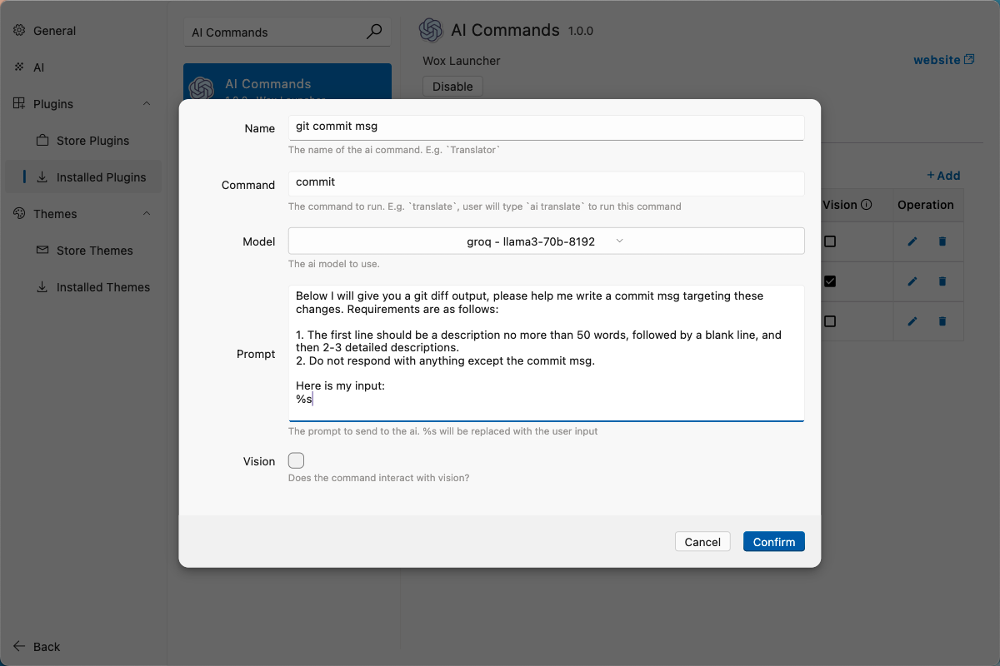

# AI 命令

Wox 允许您将 AI 能力直接集成到您的工作流中。

## 自动 Git 提交信息

此功能允许您从终端使用 Wox AI 命令自动生成提交信息。

### 设置

1. **添加 AI 命令**

   - 在 Wox 中查询 `aicommand` 并选择 `Open AI Commands settings`
   - 在设置选项卡中，点击 `Add` 按钮
   - 添加以下信息：

     - **Name**: `git commit msg`
     - **Query**: `commit`
     - **Model**: `<您的选择>`
     - **Prompt**:

       ```
       Below I will give you a git diff output, please help me write a commit msg targeting these changes. Requirements are as follows:
        - The first line should be a description no more than 50 words, followed by a blank line, and then 2-3 detailed descriptions.
        - Do not respond with anything except the commit msg.

       Here is my input:
       %s
       ```

     - **Vision**: No

   

2. **配置 Bash 脚本**
   要使用此功能，您可以将以下脚本添加到您的 `.bashrc` 或 `.zshrc` 文件中：

   ```bash
   commit() {
       open "wox://query?q=ai commit $(cat)"
   }
   ```

### 用法

设置完成后，您可以通过执行以下命令在您的 git 项目中使用此功能：

```bash
git diff | commit
```

此命令将自动调用 Wox 并为您生成提交信息。


